# QA Report — Crown & Colony

> **Auto-generated from CI** on 2026-06-23 at commit `f607d71` (save format **v58**). Do not hand-edit — this file is rewritten by [`scripts/generate-qa-report.py`](../scripts/generate-qa-report.py) on every CI run from the actual `dotnet test` results.
> This is a committed, point-in-time QA snapshot combining the **test results** (below) and the **visual goldens** (screenshots) in one place.
> **End-to-end journeys:** the connected player-journey coverage is specified in [TEST-PLAN.md](TEST-PLAN.md).
> **Live, always-current results:** the [GitHub Actions CI runs](https://github.com/BiffstaGaming/crown-and-colony/actions) — every push is gated on these same suites.

## Test results (this snapshot)

| Layer | What it checks | Tooling | Count | Status | Where it runs |
|---|---|---|---:|:--:|---|
| **L1 Unit** | Rules, formulas, state transitions (engine-free) | xUnit | included in 2159 | ✅ | every push |
| **L2 Scenario** | Scripted multi-turn games, FreeCol cross-checks | xUnit | included in 2159 | ✅ | every push |
| **L1+L2 total** | (the engine-free `GameLogic` suite) | xUnit | **2159** | ✅ | every push |
| ↳ of which **E2E journeys** | Connected player journeys, milestone-asserted ([TEST-PLAN.md](TEST-PLAN.md)) | xUnit `[Trait E2E]` | 11 | ✅ | every push |
| **L3 Interaction** | Real scenes driven by simulated input/signals | GdUnit4 | 0 | — | every push (CI) |
| **L4 Visual** | Golden-screenshot diff of the rendered map/UI | GdUnit4 + custom diff | 0 | — | every push (CI) |
| **L5 Soak** | Multi-seed long runs + per-turn perf budget | xUnit | 5 | ✅ | nightly |
| | | | **2164** | **all green** | |

Reproduce locally (toolchain in [CLAUDE.md](../CLAUDE.md)):
```
dotnet test game/tests/GameLogic.Tests/GameLogic.Tests.csproj --filter "Category!=Soak"   # L1+L2 (2159)
dotnet test game/tests/GameLogic.Tests/GameLogic.Tests.csproj --filter "Category=Soak"    # L5 (5)
dotnet test game/CrownAndColony.csproj --settings game/gdunit.runsettings                 # L3+L4 (0), needs GODOT_BIN
```

## Visual goldens (committed screenshots)

These are the reference images the L4 suite diffs every render against. A push that changes the rendered output fails CI unless the golden is deliberately regenerated. See [map-goldens.md](visual-tests/map-goldens.md) and [menu-goldens.md](visual-tests/menu-goldens.md) for the per-golden definitions (scene, seed, tolerance, human-check list).

### `colony-panel-seed424242`
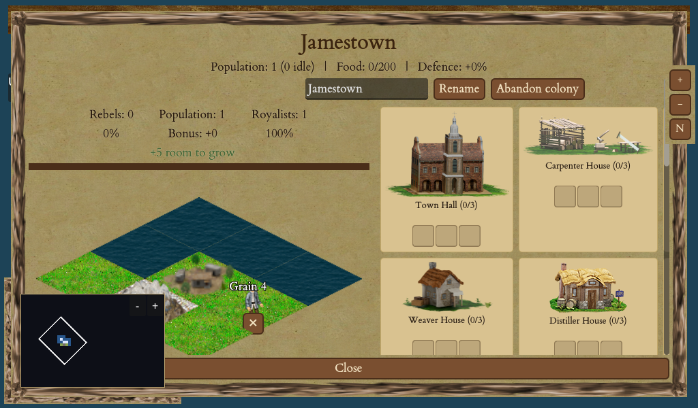

### `colony-seed424242`
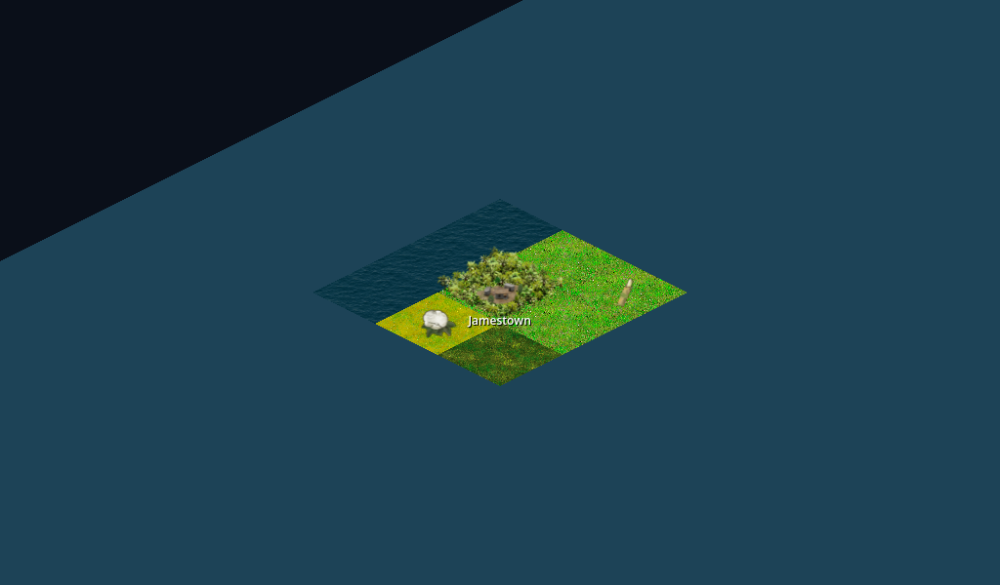

### `europe-panel`
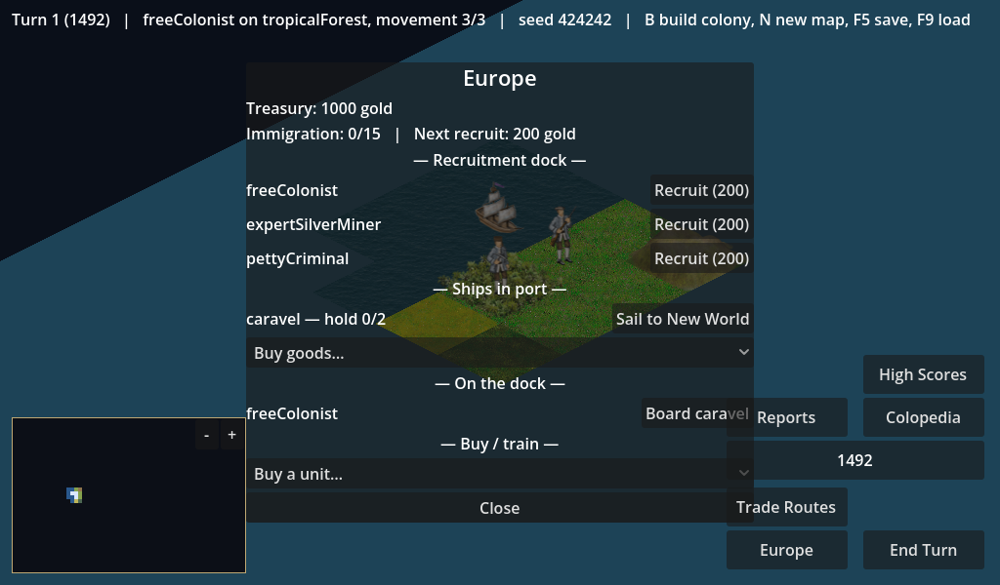

### `info-popup`
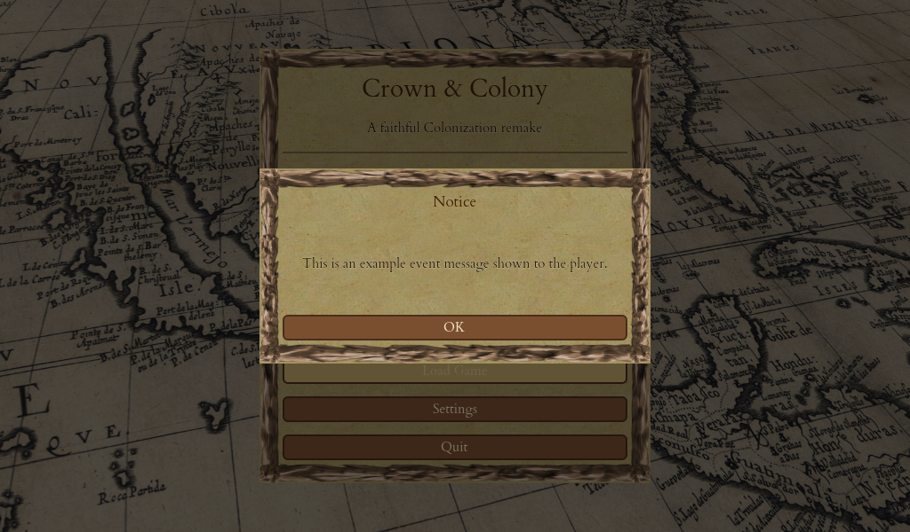

### `main-menu`
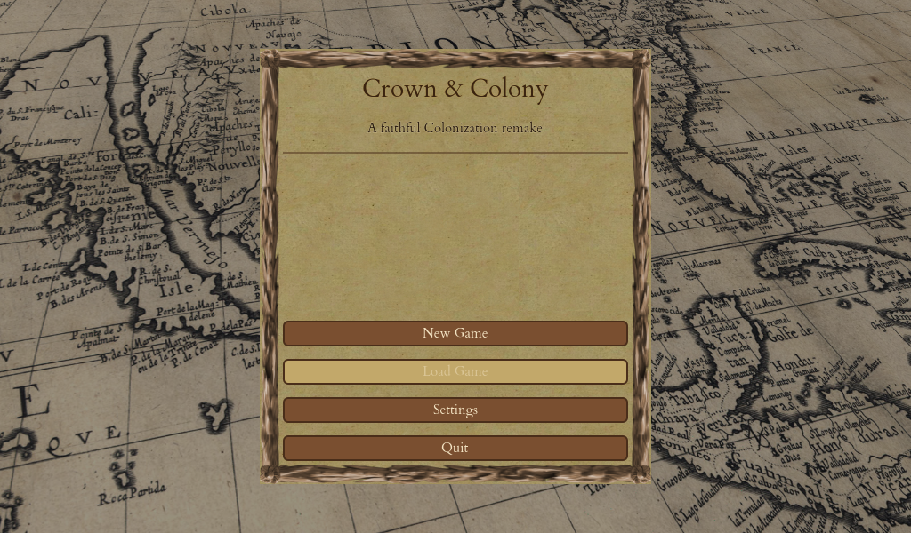

### `map-seed424242`
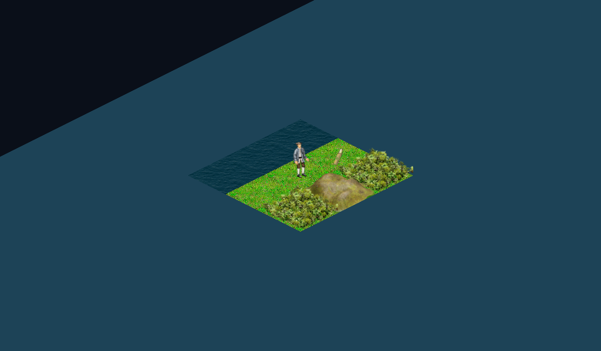

### `minimap-seed424242`
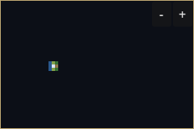

### `native-settlement-seed424242`
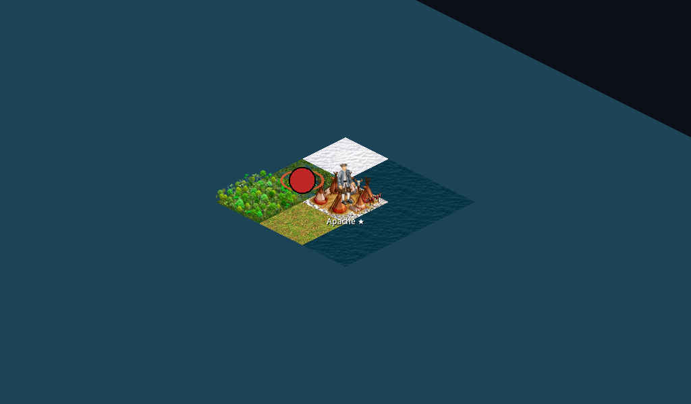

### `pause-menu`
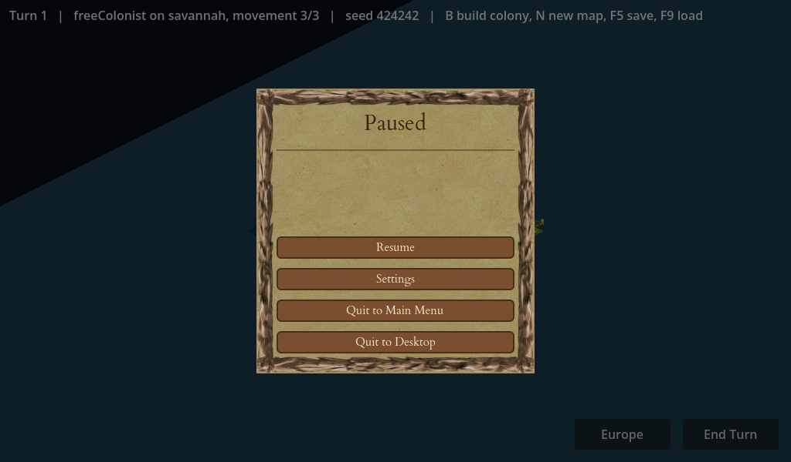

### `remembered-fog-seed424242`
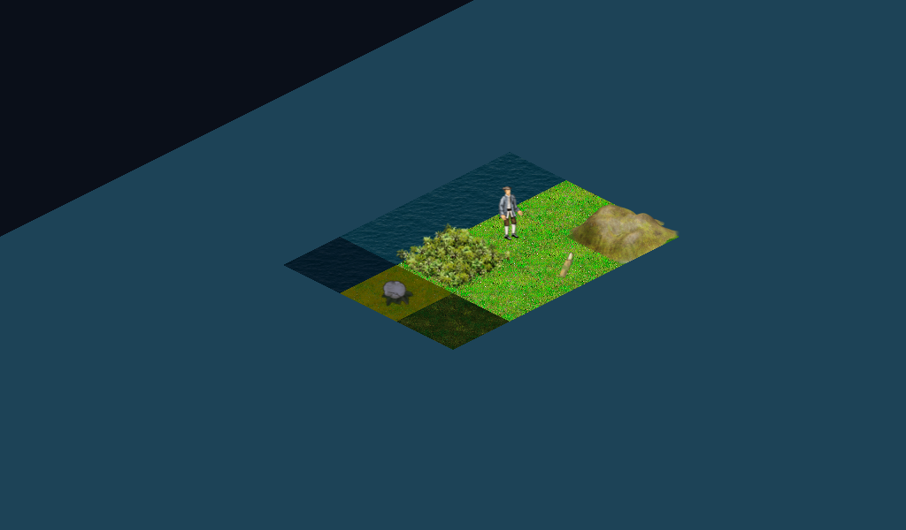

### `rendered-units-seed424242`
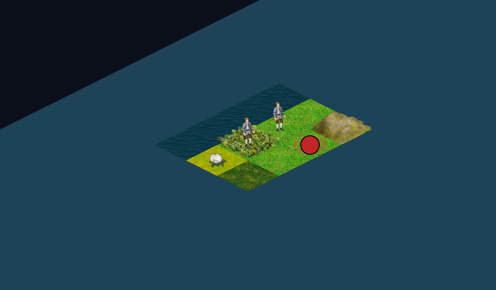

### `river-seed424242`
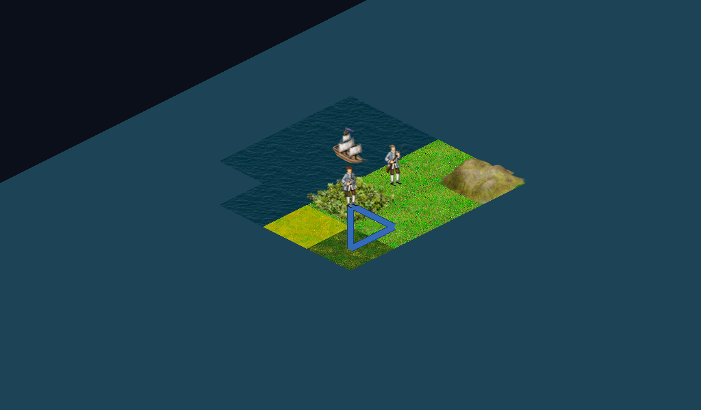

### `rumour-marker-seed424242`
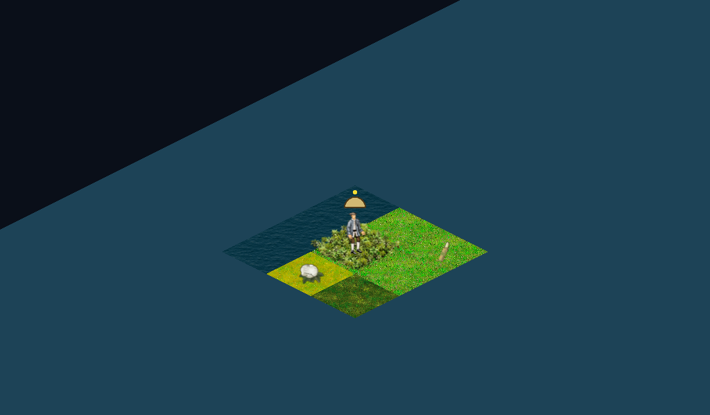

### `settings-screen`
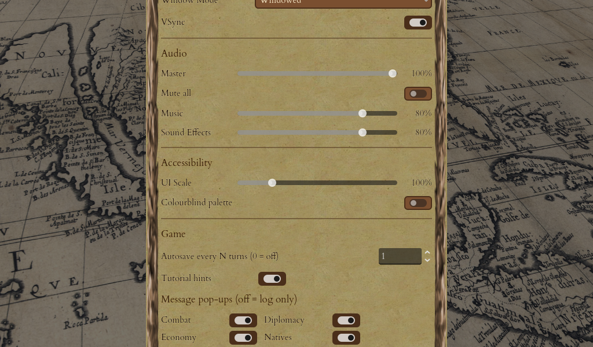

## Per-system coverage

Each system doc carries its own five-layer verification table; that is the authoritative per-system status. Browse [docs/systems/](systems/) for the current matrix per game system.

---

## How this is generated

This file is **machine-generated** — do not hand-edit it; your edits are overwritten on the next CI run. To change its layout, edit [`scripts/generate-qa-report.py`](../scripts/generate-qa-report.py).

- The **nightly** workflow ([`.github/workflows/nightly.yml`](../.github/workflows/nightly.yml)) runs the full logic suite + the L5 soak run, emits `dotnet test` **TRX** result files, pulls the latest L3/L4 scene TRX from the most recent successful CI run, then runs the generator and commits the refreshed report back to the branch.
- The **push/PR** CI workflow ([`.github/workflows/ci.yml`](../.github/workflows/ci.yml)) uploads the L1+L2 and L3+L4 TRX as artifacts (`trx-logic`, `trx-scene`) so the report can be regenerated or inspected for any run.
- Counts come straight from the TRX `<Counters>`; the **save version** is read live from `SaveGame.CurrentVersion`; **E2E** is the `JourneyTests` class count; the **L3/L4** split classifies scene tests by class name (`*Visual*`/`*Golden*` → L4). The generator degrades gracefully — a missing TRX renders that layer as `—` rather than failing.
- Regenerate locally: `python scripts/generate-qa-report.py --logic-trx <path> [--soak-trx <path>] [--scene-trx <path>]`.
