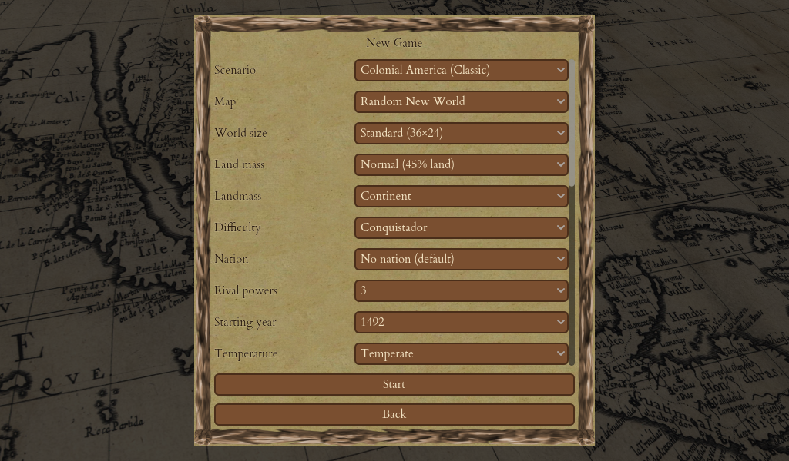
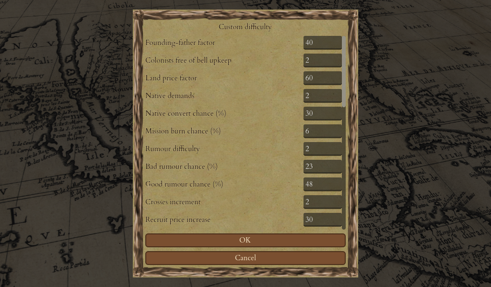

# Starting a New Game

Every game of Crown & Colony begins at the **title screen** and, from there, at the **New Game** setup panel — the handful of choices that shape the world you are about to lead. This chapter walks you through both. If you just want to get playing, the good news is that every setting has a sensible default, so you can leave them all alone and press **Start** for a faithful, classic game. If you want to tailor the challenge, read on.

<figure markdown="span">
{ width="720" }
<figcaption>The New Game setup — scenario, map, size, difficulty and nation, each with a sensible default.</figcaption>
</figure>

## The main menu

When you launch the game you arrive at the title screen — the game's name over an antique map of the New World — with six choices:

- **New Game** — start a fresh game. This opens the setup panel described below.
- **Load Game** — open the save-slot dialog and resume a saved game.
- **Settings** — open the options screen for video and audio.
- **Help** — open the in-game guide: the goal, the core gameplay loops, and a controls reference.
- **About** — show the version and licence.
- **Quit** — close the game. Nothing is in progress, so it exits immediately without asking.

For a fuller tour of what you will see once the game begins, see [The Screen & Interface](03-interface.md).

## The New Game setup panel

Choosing **New Game** opens a setup panel where you decide how this game will be shaped. Work down the panel and set what you care about; leave the rest on their defaults.

| Option | What it does |
|---|---|
| **Scenario** | The ruleset that defines the world. Today this lists only *Colonial America (Classic)*. Future variants — such as an Australia setting — will appear here as extra lines, changing nothing else about the screen. |
| **Map** | *Random New World* (a freshly generated continent) or *America (fixed)* (a hand-drawn map of the Americas). |
| **World size** | Small, Standard, Large or Huge. A bigger map means more room to expand — and a stronger King's army waiting for you at the end. |
| **Land mass** | How much of a random map is land, from sparse to dense. More land means larger continents and fewer islands. |
| **Landmass shape** | The shape of the land on a random map: one *Continent*, a few large islands, or many small islands. |
| **Difficulty** | The five classic levels, from the gentlest to the harshest. Higher difficulty means more interference from the King, costlier recruits, and a tougher Royal Expeditionary Force. |
| **Nation** | The European power you play — Dutch, French, English or Spanish — or *No nation* for the classic nation-less start. |
| **Victory conditions** | Which of the win checks are switched on (see below and [Winning the Game & Scoring](20-winning-scoring.md)). |
| **Fog of war** | Whether explored land you can't currently see is remembered but hidden, or stays permanently in view. |
| **Custom house** | Whether a colony's custom house will sell goods that are under boycott. |

!!! tip
    Every option is pre-set to its default, and those defaults reproduce the exact classic game. If you are unsure, just press **Start**: you will get a standard *Colonial America* game with the historical balance.

### Options that only apply to random maps

The **world size**, **land mass** and **landmass shape** options describe how a *generated* map is built. They do nothing to the hand-drawn America map, which sets its own size and shape. If you pick the fixed America map, those three options are greyed out.

### Choosing your difficulty

Classic Colonization ships **five difficulty levels**, and the game is balanced around the middle one, which is the default. Higher levels squeeze you in every direction — founding fathers cost more liberty, recruits get pricier faster, the natives are greedier, and the Royal Expeditionary Force that crosses the ocean at independence is larger.

For players who want to fine-tune the numbers themselves, the difficulty list also offers a **Custom…** option. Selecting it opens an editor that lists the individual tuning numbers — the founding-father cost, native demands, the tax cap, the size of the King's invasion force, and so on — pre-filled with the values of the level you were on. Change any of them, press OK, and the game starts with your numbers.

!!! warning
    Custom difficulty edits last for the current game session only. A saved game remembers the **base level** you started from, so if you reload, the game returns to that level's standard numbers. Your game is still perfectly playable — it just plays by the stock balance again.

### Choosing your nation

You lead one of four European powers — **Dutch**, **French**, **English** or **Spanish** — or you can choose **No nation** for the classic nation-less start. Each power has its own advantage. The one you will notice most directly is the **Dutch market advantage**: the Dutch feel Europe's prices move only half as far when they trade, so they can sell larger quantities without crashing the price. The other nations' strengths, and the full details, are described in the in-game Colopedia.

### Victory conditions and map options

The setup panel also lets you switch win conditions on or off. By default you can win by **defeating the Royal Expeditionary Force** (the headline victory) and by becoming the **last European power standing**. A "last human standing" condition also exists but is meant for multiplayer and is off by default. See [Winning the Game & Scoring](20-winning-scoring.md) for what each entails.

Two more toggles shape play:

- **Fog of war** (on by default): explored land you can't currently see is shown dimmed and "remembered" — you see it as you last left it, and enemy movements there are hidden until you look again. Turn it off to keep every explored tile permanently visible.
- **Custom house sells boycotted goods** (on by default): once you can build a custom house, it will smuggle out even goods under boycott. Turn this off and it skips boycotted goods.

Press **Start** and the New World appears, with your first ship and colonist, on turn 1. From here, head to [Exploration & Discovery](06-exploration.md) to make your first moves.

## Saving, loading and quitting

You never have to finish a game in one sitting. Crown & Colony keeps your progress several ways:

- **Quick save / quick load** — press `F5` to quick-save and `F9` to reload it at any moment.
- **Save and load slots** — from the pause menu (press `Esc` during play) or the main menu's **Load Game**, you can use five named save slots. Each filled slot shows the turn it holds and when you saved it, and a filled slot can be deleted to free it up. Saving over a filled slot asks you to confirm first.
- **Autosave** — by default the game quietly saves itself into its own Autosave slot at the end of every turn, so you always have a recent fallback. You can change how often this happens, or turn it off, in **Settings → Game**. The Autosave entry appears in the slot list and can be loaded like any other, but a manual save never overwrites it.
- **Pause menu** — press `Esc` during play to pause and bring up Resume, Save, Load, Settings and Quit.

<figure markdown="span">
{ width="620" }
<figcaption>Choosing <strong>Custom</strong> difficulty opens an editor for the individual tuning numbers — Founding-Father cost, land prices, native behaviour and more.</figcaption>
</figure>

!!! info "How the difficulty levels compare"
    For a side-by-side of what the five standard levels change — the tax ceiling, the liberty cost of each Founding Father, land prices and native conversion — see [Tables & Data → Difficulty levels](23-tables-data.md#difficulty-levels).

That is everything you need to get a game underway. Next, get your bearings with [The Screen & Interface](03-interface.md).
