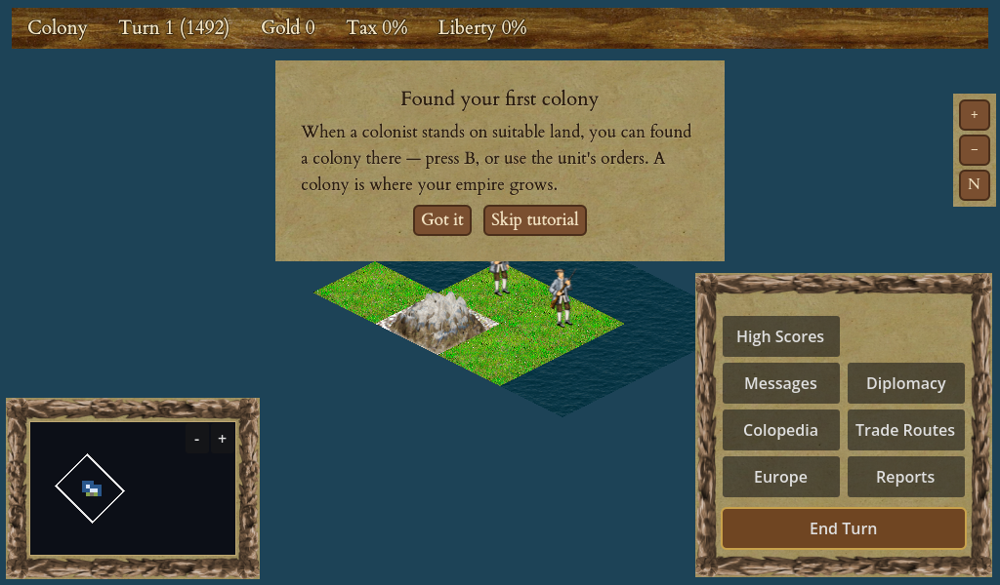

# The Screen & Interface

Crown & Colony is played mostly with the mouse: click a unit to select it, click a tile to move it or give an order, and click one of your colonies to open its management screen. The keyboard supplies shortcuts for the common actions, but you never have to memorise them. This chapter walks you around the main screen, shows you how to steer the camera, and explains what happens when you end a turn.

<figure markdown="span">
{ width="720" }
<figcaption>The main screen: the top status bar, the isometric map, the framed minimap (with its view-box), and the right-hand action cluster.</figcaption>
</figure>

## The main screen at a glance

The bulk of the screen is the map — the New World you are exploring and settling. Around it sit the panels and buttons that tell you how your colony is doing and let you issue orders.

- **Status readouts** keep you informed of your nation, the turn number, and the date. A dedicated date readout near the turn controls shows the current year — for example `1492` early in the game, and later `Spring 1600` once the calendar splits into two turns a year (see [The Map & Terrain](04-map-terrain.md) for more on the calendar). Your gold, tax rate and liberty standing feed the decisions you make about trading and independence.
- **The selected-unit panel** appears when you click one of your units. It shows what the unit is and its orders, and grows order buttons for what it can do right now — including a **Skip** button and a **Disband** button (the Disband button only lights up when the unit can actually be disbanded).
- **The minimap** gives you the whole map in miniature. It carries a live **view box** that shows exactly which part of the map you are currently looking at, and it follows the camera as you move. Click anywhere on the minimap to recentre the main view there.
- **The action cluster** in the corner holds the buttons for the screens you visit often — Europe, Reports, the Colopedia, the message log, and more — alongside the all-important **End Turn** button. When you open a full-screen panel such as a colony or the Europe screen, these corner buttons tuck away so they never overlap the open panel, and they return when you close it.

!!! tip
    Hover the mouse over any explored tile and the tile-info readout shows that tile's terrain **plus a yield preview** — the goods a colonist could produce there and how much. Use it to scout good colony sites before you commit a settler. An unexplored tile shows no yields until you have seen it.

## Moving the camera

You have several ways to move your view around the map, and you can mix and match whichever feels comfortable:

- **Drag** the map by holding the **right** or **middle** mouse button and moving the mouse.
- **Edge-scroll** by pushing the cursor against the edge of the screen; the view slides that way.
- **Arrow keys** slide the camera while you hold them — and the on-screen speed stays the same however far in or out you have zoomed.
- **Zoom** with the mouse wheel, the `+` and `-` keys, or the on-screen **+ / −** buttons in the top-right cluster. Zoom moves between a handful of fixed levels. The wheel zooms in toward whatever your cursor is pointing at, while the keys and buttons zoom about the centre of the view.
- **Recentre** on your active unit with the **"N"** button in that same top-right cluster, or press `Ctrl`+`C` to snap the camera onto the unit you currently have selected.

The camera always stays over the map — it will show a little margin past the edges but never runs off into empty space.

!!! tip
    **Right-click a tile** to open a small menu. It lets you pick any one of your units standing there (handy when several units are stacked on one square, where a left-click would only grab the first), centre the view on the tile, or send your selected unit there.

## Ending a turn

The game advances in turns. On your turn you move your units, manage your colonies and trade. When you are finished, press **End Turn** (or `Enter`) and the world resolves: every other European power and native nation takes its turn, your colonies produce and grow, immigrants arrive, ships at sea advance, native tempers cool, and the calendar moves on. Then it is your turn again.

### The turn report and message log

Everything that happened to you while the computer players took their turns — a privateer sinking a ship, a tribe raiding a colony, the King changing your tax, a colony starving — is collected into a dismissible "this turn's events" panel that pops up, and is also kept in a **message log** you can re-open any time from the **Messages** button.

Each event is tagged with a category — combat, diplomacy, economy, natives, monarch or colony — and the log carries a row of checkboxes: un-tick a category to hide that kind of message. Your choice is remembered between sessions. The log is saved with your game, so loading an old save brings back the history you had built up rather than starting blank.

!!! tip
    In **Settings** you can also decide, per category, which events pop up the end-of-turn panel and which are logged quietly. A silenced category still appears in the re-openable log — it just no longer interrupts you. See [Managing a Colony](08-managing-colony.md) for the colony-side reports these messages point you toward.

## Other screens

Several dedicated screens sit one keystroke or one button-click away:

| Screen | Opens with | What it is for |
|---|---|---|
| Europe | `E` | Sell goods, buy ships and specialists, and recruit colonists (see [Trade & the Europe Screen](12-trade-europe.md)) |
| Founding Fathers | `F` | Choose whom to pursue for your Continental Congress (see [Founding Fathers & the Continental Congress](14-founding-fathers.md)) |
| Find settlement | `L` | Locate and jump to one of your own colonies |
| Colopedia | `C` | The in-game reference of units, goods and buildings (see [Reference & Colopedia](22-reference.md)) |
| Reports & message log | corner buttons | Review the state of your empire and re-read this turn's events |

Pressing `Esc` at any time opens the **pause menu**, which freezes the game and offers Resume, Save, Load, Settings, Help, About and the two Quit options. If you try to quit with unsaved changes, the game offers to save first.

## Where to find the keys

You never have to remember a shortcut. Press `F1` in the game view to pop up an on-screen legend listing every key and what it currently does. If you would rather use a different key for something, open **Settings → Key Bindings…**, click **Rebind** next to any shortcut, and press the key you prefer — it takes effect straight away, is remembered next time you play, and the `F1` legend always shows your current keys. The full, printable key reference lives in [Reference & Colopedia](22-reference.md).

!!! warning
    While you are typing into a text box — naming a save slot, or using a search field — the shortcuts stand down so your letters don't accidentally trigger an action. This is normal; the keys wake up again as soon as you click away from the text field.
