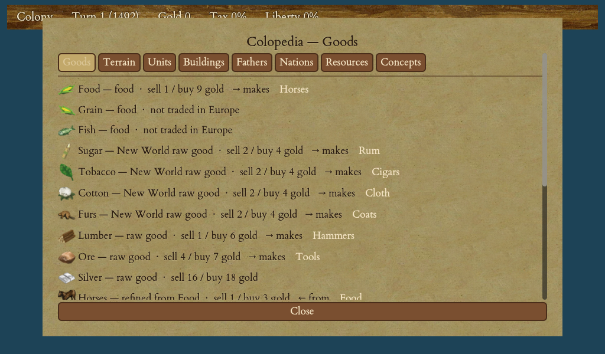

# Goods & Production Chains

Everything your colonies do comes down to goods. You gather raw materials from the land, turn them into finished products inside your buildings, and sell those products in Europe or trade them to the natives for gold. This chapter explains the goods, how they chain together into products, and how to read a colony's production so you can spot and fix problems.

<figure markdown="span">
{ width="720" }
<figcaption>Every good, its starting price and the chain that refines it — the Colopedia's Goods tab.</figcaption>
</figure>

If you have not yet set up a colony's workers, read [Managing a Colony](08-managing-colony.md) first; this chapter builds on it.

## Raw goods versus manufactured goods

Goods come in two broad kinds:

- **Raw goods** are gathered from the tiles around a colony. A colonist standing on a forest cuts **lumber** or traps **furs**; on plains grows **cotton** and food; on hills mines **ore**; and the land also yields **sugar** and **tobacco** where the terrain suits. These are the inputs to your economy.
- **Manufactured goods** are made *inside* the colony by a worker in a building, who consumes a raw good and produces a finished one. A weaver turns cotton into **cloth**; a distiller turns sugar into **rum**; a blacksmith turns ore into **tools**; a gunsmith turns tools into **muskets**, and so on.

Manufactured goods sell for far more than the raw material they came from, so the heart of a strong economy is refining your own harvest rather than shipping raw goods across the ocean.

## The production chains

Each finished product has a fixed chain: a raw good, the worker who refines it, and the product. Line up a gatherer on the right tile and a crafter in the right building and the chain runs by itself every turn.

| Raw good | Made by | Finished good |
|---|---|---|
| Sugar | Distiller | Rum |
| Tobacco | Tobacconist | Cigars |
| Cotton | Weaver | Cloth |
| Furs | Fur trader | Coats |
| Ore | Blacksmith | Tools |
| Tools | Gunsmith | Muskets |

Two of these are worth noting. **Ore** is the root of the war economy: ore becomes tools, and tools in turn become muskets. And **lumber**, gathered from forest, is refined by a carpenter into **hammers**, the building material every construction project consumes (see [Buildings](11-buildings.md)).

!!! tip
    Each building has an upgraded version (and, later, a top-tier factory unlocked by a Founding Father) that lets an expert produce far more of the same product. Staffing a better workshop with the matching expert is how you scale a chain up without adding more colonists.

## Tools and muskets as inputs

Tools and muskets are unusual: they are manufactured goods, but you also *spend* them rather than only selling them.

- **Tools** are used to equip a **pioneer** (a colonist sent out to improve the land) and are consumed by some larger construction projects alongside hammers.
- **Muskets** arm a colonist into a **soldier**. Add horses and you get a **dragoon**.

Because tools feed both muskets and pioneers, a colony that mass-produces muskets needs a steady ore-to-tools supply behind it, or the gunsmith will sit idle.

## Horses

Horses are bred, not manufactured. A colony's **pasture** (a free starting building, upgradeable to a **stables**) grows the herd each turn from *surplus* food only, so breeding never eats into your colonists' rations and can never starve a colony.

- You need at least **2 horses** to start a herd; from there the larger the herd the faster it grows, and a stables roughly doubles the rate.
- The herd stops growing when it hits the warehouse cap.
- Horses turn a soldier into a faster, harder-hitting **dragoon**, and turn a colonist into a **scout** for exploring (see [Units & Movement](05-units-movement.md)).

## Liberty bells and crosses: the goods you never sell

Three goods never sit in your warehouse and cannot be sold on any market: **liberty bells**, **crosses**, and **hammers**. They are produced and immediately spent on something other than trade.

- **Liberty bells**, produced by your **town hall**, raise each colony's Sons of Liberty membership and accumulate toward recruiting Founding Fathers. This is your road to independence (see [Founding Fathers & the Continental Congress](14-founding-fathers.md) and [The Road to Independence](18-road-to-independence.md)).
- **Crosses**, produced by **churches and chapels**, speed immigration — the more crosses, the sooner new colonists appear on the Europe dock.
- **Hammers** are the building material consumed by construction.

Do not neglect bells and crosses just because they earn no gold: they are how your nation grows in people and in liberty.

## Balancing gatherers with crafters

A production chain only runs as fast as its slowest link. Put three weavers in a weaver's shop but only one colonist picking cotton, and two of the weavers will starve for input and produce almost nothing. The art of a colony is matching **gatherers** (tile workers producing the raw good) to **crafters** (building workers consuming it).

A rough rule: aim to produce at least as much raw material each turn as your crafters consume. If you have surplus raw goods piling up, add a crafter; if crafters are starved, add a gatherer or move one across.

!!! warning
    A warehouse holds only a limited amount of each good, and anything produced past that cap each turn is **wasted**. The colony screen flags a good near the cap with an amber **▲** warning and a good running low with a red **▼**. If cotton is overflowing while your weaver runs short of it, you are both wasting harvest and starving production — rebalance, build a warehouse, or ship the surplus out.

## Reading net production and fixing shortfalls

Open a colony and look at the **production overview** — a per-good table showing what the colony **produces**, what it **consumes**, and the **net** each turn, for food, raw goods, manufactured goods, bells, crosses and hammers. The bar along the top of the colony screen shows the net figure for each good at a glance; the overview shows the full breakdown behind it.

Reading net production turns guesswork into diagnosis. When a chain is not working, the numbers tell you why:

1. **Net raw good is negative** (say, cloth's cotton line shows more consumed than produced). Your crafters out-number your cotton harvest. Move a colonist onto a cotton tile, or take a weaver off the shop.
2. **Net raw good is piling up positive** and the warehouse is filling. You are gathering more than you refine — add a crafter to turn that surplus into a sellable product.
3. **A manufactured good sits at zero** despite a staffed building. The building has no input. Check that its raw good is being gathered (use each tile's **Work…** picker to switch a tile to the good you need).
4. **Food net is negative.** The colony is heading for starvation. Shift workers onto food tiles before a colonist is lost — food always comes first.

!!! tip
    For every good's exact **starting price** and every building's **per-worker input→output**, see the generated [goods](23-tables-data.md#goods-the-market) and [buildings](23-tables-data.md#buildings) tables in Tables & Data — or open the in-game **Colopedia** with `C` for the live figures. This chapter teaches the shape of the system so those numbers make sense.

Once your chains are balanced and your warehouses aren't overflowing, you have a colony that quietly produces sellable goods every turn — ready to feed [Trade & the Europe Screen](12-trade-europe.md) and bankroll your ambitions.
