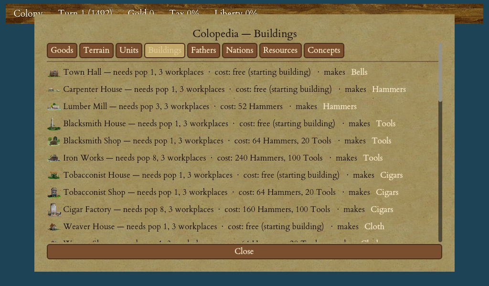

# Buildings

Your colonists do two kinds of work. Some go out to the tiles around the colony to gather food and raw goods; the rest stay **inside the colony**, working in its buildings. This chapter is about those buildings — what they do, how you put them up, and the order that gets a young colony on its feet fastest.

<figure markdown="span">
{ width="720" }
<figcaption>Every building, the population it needs, its cost, and what it produces or grants.</figcaption>
</figure>

If you have not yet read [Managing a Colony](08-managing-colony.md) and [Goods & Production Chains](10-goods-production.md), start there. This chapter builds on both.

## What a building does

Every building fills one of a few roles:

- **Workshops** take a colonist and a raw good and turn it into a finished product. A weaver in a weaver's house turns cotton into cloth; a distiller turns sugar into rum; a blacksmith turns ore into tools; a gunsmith turns tools into muskets.
- **Civic buildings** produce the things you cannot sell but cannot do without — **liberty bells** (from the town hall) and **crosses** (from a church).
- **Logistics and infrastructure** buildings change what the colony *can* do rather than making a good: a warehouse stores more, docks let you work sea tiles, a shipyard lets you build ships.
- **Defensive works** make the colony harder to capture.

You staff a building from the colony screen using its **+ / −** controls, up to the number of work slots it has. Put your best expert in the workshop that matches their trade — an expert's bonus grows in the better workshops (see below).

!!! tip
    Every new colony starts with a set of **free base buildings** — a town hall, a carpenter's house, a blacksmith's house, a pasture and more — at no cost. You never build these; they are there from turn one so a fresh colony can already ring a bell, saw hammers and breed a horse.

## Manufacturing tiers

Most workshops come in **three tiers**, each an upgrade of the one before. The base house is free; you pay hammers (and later tools) to reach the higher tiers, which produce more.

| Good | Base house | Second tier | Factory tier |
|---|---|---|---|
| Hammers (from lumber) | Carpenter's house | Lumber mill | — |
| Tools (from ore) | Blacksmith's house | Blacksmith's shop | Iron works |
| Cloth (from cotton) | Weaver's house | Weaver's shop | Textile mill |
| Rum (from sugar) | Distiller's house | Distillery | Rum factory |
| Cigars (from tobacco) | Tobacconist's house | Tobacconist's shop | Cigar factory |
| Coats (from furs) | Fur trader's house | Fur trading post | Fur factory |

The **factory (top) tier** is not available from the start — it unlocks once you recruit the Founding Father **Adam Smith** (see [Founding Fathers & the Continental Congress](14-founding-fathers.md)).

Better workshops also reward your specialists. An expert's flat bonus is **doubled** in a second-tier building and **tripled** in a factory — the same master carpenter who adds a little in the carpenter's house adds far more in a lumber mill. So an upgrade pays off twice: it lifts everyone's output, and it makes your experts worth even more.

## Civic buildings: bells, crosses and schools

- **Town hall** — produces your colony's **liberty bells**. Bells raise the colony's Sons of Liberty membership and accumulate toward Founding Fathers. This is the political engine of the game; see [Founding Fathers & the Continental Congress](14-founding-fathers.md).
- **Church chain** — a **chapel** makes crosses, which speed immigration from Europe. Upgrade it to a **church** and then a **cathedral** for more crosses. Note that only a **church or cathedral** can ordain a missionary — a chapel cannot.
- **School chain** — a **schoolhouse**, upgraded to a **college** and then a **university**, lets an expert stationed inside teach the colony's least-skilled colonist their trade. This is how you train specialists at home instead of buying them in Europe; see [Colonists, Professions & Education](09-colonists-education.md).

### Multiplier buildings for bells

Two special civic buildings don't make bells themselves — they **multiply** the bells your town hall already produces. Build a **printing press**, then upgrade it to a **newspaper**, and each colony's bell output rises sharply. Because liberty is the road to independence, a printing press is one of the highest-value buildings you can put up in a busy colony.

## Logistics: warehouses and ships

- **Warehouse** — each colony stores only so much of each good; the surplus produced past that cap each turn is **wasted**. A **warehouse**, then a **warehouse expansion**, raises the ceiling so a productive colony stops throwing away goods it can't ship in time.
- **Docks** — let colonists work the **water tiles** around a coastal colony to catch fish. Without docks, sea tiles sit idle.
- **Shipyard** — a **shipyard** lets a coastal colony **build ships** of its own. It requires a port, so it is for coastal colonies only.

!!! warning
    A colony's warehouse holds a limited amount of each good, and anything produced above that line each turn is lost. The colony screen flags a good that is **about to overflow** — build a warehouse, set up a trade route, or sell the surplus before End Turn wastes it.

## Defensive works

Three tiers of fortification make a colony progressively harder to capture, each giving a larger defensive bonus to the units inside:

| Fortification | Defence bonus |
|---|---|
| Stockade | +100% |
| Fort | +150% |
| Fortress | +200% |

A fortress is a serious obstacle to any attacker. One catch worth knowing: a colony that has built **any** fortification **cannot be abandoned** — so don't wall up a colony you might later want to give up.

## The custom house

The **custom house** is a special building that quietly **sells your surplus goods to Europe every turn**, with no ship leaving port — even through a blockade, and even after you declare independence. From the colony screen you tick each good you want exported and set how much to keep in the warehouse; everything above that line sells at the market price each turn.

It is not available at the start: you must first recruit the Founding Father **Peter Stuyvesant**. Once you have him, you can build a custom house in any colony (unless you turned on the optional "coastal only" rule at setup). See [Trade & the Europe Screen](12-trade-europe.md) for how selling works.

## Build costs and construction order

You queue construction from the colony screen. Each building costs **hammers** — sawn by carpenters from lumber — and some also cost **tools**, made by a blacksmith from ore. The colony banks materials over several turns and completes the item once it has enough; you can line up several builds in the queue and let the colony work through them by itself. You can also build **units** here — a wagon train (40 hammers) in any colony, or artillery (192 hammers plus 40 tools) once you've built an armory.

For the full hammer-and-tool cost of every building, open the in-game **Colopedia** (press `C`) — it lists them all.

A reliable early construction order for a new colony:

1. **Warehouse** — so you stop wasting the goods you're already making.
2. **A workshop upgrade** for whatever raw good the colony is richest in (lumber mill on a forested colony, weaver's shop on cotton land).
3. **Docks**, if the colony is coastal and has good fishing tiles.
4. **Printing press** — to multiply your liberty bells once the basics are covered.
5. **Stockade** — the first, cheapest step of defence, especially near natives or rivals.

Beyond that, follow your strategy: churches for immigration, schools to train experts, a shipyard to build your own fleet, forts and a fortress where war threatens. Let no single colony try to do everything — specialise each one around the land it sits on.
