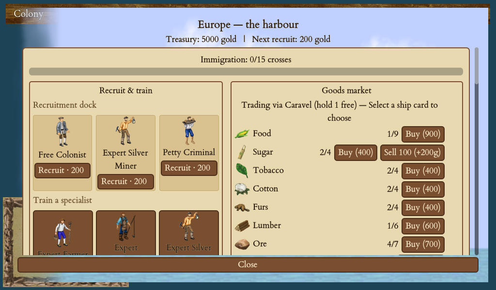
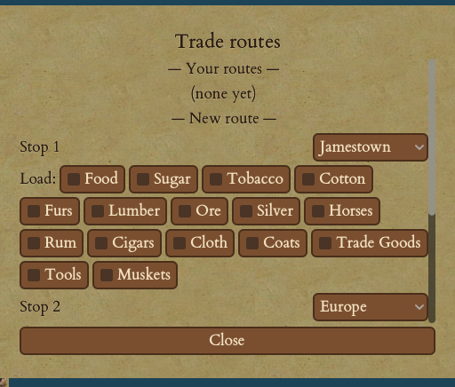

# Trade & the Europe Screen

Your colonies pull raw goods from the land and turn them into finished
products, but a warehouse full of coats and cigars is worth nothing until
you sell it. This chapter covers where that selling happens — the **Europe
screen**, your mother country's harbour — how prices rise and fall, and the
many ways to move goods to market: by ship, by custom house, by trade route,
and by trading with the people already living in the New World.

<figure markdown="span">
{ width="720" }
<figcaption>The Europe harbour — the goods market with live buy/sell prices, the recruitment dock, and your ships in port.</figcaption>
</figure>

If you have not yet read [Goods & Production Chains](10-goods-production.md),
skim it first — this chapter assumes you know what your colonies produce and
why. For the buildings that generate income (churches, custom houses), see
[Buildings](11-buildings.md).

## The Europe screen

Press `E` (or send a ship into port) to open **Europe** — laid out like a
dockside harbour rather than a list of menus. At a glance it shows you:

- **Your treasury** — the gold you have to spend.
- **The recruitment dock** — colonists waiting to sail, each with a name,
  picture and price.
- **An immigration progress bar** — how close the next free emigrant is to
  arriving (see *Recruiting immigrants*, below).
- **Ships in port** — each shown as a card with its cargo hold drawn out as
  slot boxes, so you can see at a glance what is loaded and how full it is.
- **Ships in transit** — two lanes for the ships you cannot see on the map
  because they are at sea: those crossing *towards* Europe and those you have
  sent *home*, each counting down the turns until it arrives.

From this one screen you sell cargo, buy goods and units, recruit colonists,
put them aboard a ship, and send everything home.

!!! tip
    Units sitting in Europe are **not** drawn on the map — they live only on
    this screen. If a colonist or ship seems to have vanished, it is probably
    in port. Open the Europe screen to find it.

## Selling cargo and buying goods

With a ship in port, every tradeable good appears as a market row showing its
current **sell price** (what you receive) and **buy price** (what you would
pay), plus a **Buy** button and a **Sell** button for each stack the ship is
carrying.

- **Selling** empties a stack from the hold into the market and credits your
  treasury. The Sell button shows the gold that will actually **bank** — after
  the King's tax and after the price slides as your goods flood the market —
  not the headline sticker price.
- **Buying** loads a hundred-unit lot of a good into the ship's hold at the
  buy price and debits your gold.

If you prefer, you can **drag** things around instead of hunting for buttons:
drag a good from the market onto a ship to buy it, drag a hold stack onto the
market to sell it, or drag a colonist onto a ship to put it aboard. Every
button still works — dragging is just a faster alternative.

When more than one ship is in port, **click a ship's card** to choose which one
the market trades through; it is marked as the trading ship.

### Buying ships, artillery and specialists

Europe sells more than goods. The recruit-and-train card lets you spend gold on:

| What you buy | How the price behaves |
|---|---|
| **Ships** (caravel, merchantman, galleon…) | A flat price per type |
| **Artillery** | Gets dearer every time — each cannon you buy raises the price of the next |
| **Trained specialists** (expert farmer, master carpenter, veteran soldier…) | A flat price per specialist |

Any button you cannot afford is greyed out. A freshly-bought ship has never
sailed from a real tile, so on its first crossing it arrives **beside your
territory** rather than at some far corner of the map.

## How prices move

Europe's market follows **supply and demand**, and every good has its own
price band:

- **Selling a lot of a good drives its price down.** Dumping six hundred sugar
  floods the market, so the price you get slides lower with every batch — the
  market processes big trades in chunks of a hundred, so you can never offload a
  huge load all at the opening price.
- **Buying a lot pushes its price up** the same way — every load you take off
  the market makes the next one dearer.
- Each good has a **sell price and a higher buy price**; the fixed gap between
  them is the market's spread. You will never buy a good back for what you sold
  it at.

There is a **sales tax** on everything you sell, taken by the King and climbing
over the course of the game — see [The King, Taxes & Your Monarch](13-king-taxes.md).
Markets also **heal slowly**: once you have traded a good, its price drifts
gently back toward normal over the following turns, so a glut does not last
forever.

!!! tip
    The **Reports** screen has a **Trade** tab listing every good's current buy
    and sell price and flagging anything under boycott — a read-only board you
    can scan before you sail. The game also tells you at End Turn whenever one
    of your goods' prices has moved.

**The Dutch advantage:** if you play the Dutch, Europe's market reacts to your
trading only **half as strongly**. When the Dutch dump six hundred sugar the
market behaves as if only three hundred arrived, so the price slides half as far
and they keep selling profitably for longer. This is the Dutch national trait —
no other nation gets it (though each of the other nations has its own separate
advantage).

## Recruiting immigrants

New colonists arrive from Europe through **immigration**, driven by religious
unrest. Build churches and chapels to produce **crosses**; the more crosses you
make, the faster the next immigrant appears on the Europe dock, free for the
taking — you just need a ship to carry it home. The immigration bar on the
Europe screen tracks the wait.

You can also **recruit immediately for gold** instead of waiting, choosing from
the colonists currently on the dock. Each paid recruit costs a little more than
the last. (A rare **Fountain of Youth** event sends a whole wave of colonists to
your docks at once.) Immigration is covered in more depth in
[Colonists, Professions & Education](09-colonists-education.md).

## The high-seas crossing

Europe is across the ocean. To get there, sail a ship to the **high seas** — the
deep water along the map's east and west edges — and give it the **Sail to
Europe** order (a button appears on the ship's panel, and the game will also
prompt you when a ship first reaches the high seas). The crossing takes about
**three turns** each way.

- A ship leaving from the very edge makes the quick three-turn crossing. A port
  buried deeper inland, further from the open ocean, takes a turn or two longer
  — just as in the original game.
- Sail home and the ship re-enters the map where it departed. You can watch it
  cross in the Europe screen's in-transit lanes.

## Trade routes: hands-off hauling

<figure markdown="span">
{ width="380" }
<figcaption>The trade-route editor — pick the stops (colonies and/or Europe) and tick the goods to carry; a ship or wagon then runs the route on its own.</figcaption>
</figure>

Doing all of this by hand — load a ship, sail it out, sell, sail home, repeat —
gets tedious. A **trade route** automates it. Click **Trade Routes**, then:

1. Build a route as an ordered ring of **stops**. Each stop is one of your
   colonies **or Europe**, and you tick which goods to **pick up** there.
2. **Assign a carrier** — a ship or a wagon train — and it runs the loop by
   itself, every turn.

At each stop the carrier drops off everything it is carrying that the stop does
*not* list to load, picks up what the stop *does* list, and heads for the next
stop. A **Europe stop** works against the market instead of a warehouse: the
ship sells what the stop does not list and buys what it does. Only a ship can
serve a Europe stop — a wagon train cannot cross the ocean, so it skips it.

The route screen shows **amber warnings** if a route probably will not work —
too few stops, a stop you no longer own, nothing to carry, or a good you load at
every stop so it never gets dropped off anywhere. The warnings are advice, never
a wall: you can always run the route anyway.

!!! tip
    A one-colony empire can still build a simple *colony → Europe* sell run: pick
    up your surplus at the colony, sail to a Europe stop that loads nothing, and
    the ship sells the lot and comes home empty for more.

## Trading beyond Europe

Europe is not your only market.

- **Native settlements** buy goods they want and sell what they produce. Move a
  unit beside a settlement to trade with its people; a good you cannot shift in a
  glutted Europe may fetch a fine price from a native town instead. See
  [Natives & Diplomacy](15-natives-diplomacy.md).
- **Foreign colonies** — the other European powers settle the same continent, and
  you can meet, trade and negotiate with them. See
  [Rival European Powers](16-rival-powers.md).

## The custom house: selling without shipping

Once you have elected the right Founding Father (Peter Stuyvesant — see
[Founding Fathers & the Continental Congress](14-founding-fathers.md)), you can
build a **custom house** in a colony. It sells your surplus to Europe **for you,
every turn, without a ship ever leaving port** — even when your ports are
blockaded, and even after you declare independence.

From the colony screen, tick each good you want to export and set a **keep-level**
— how much to hold back in the warehouse before selling the rest. The custom
house then drip-sells everything above that line at the going market price,
minus tax, so you stop babysitting galleons just to offload spare sugar or ore.
Nothing exports until you tick it, so a freshly-built custom house earns nothing
until you switch a good on.

You can also set a **"max" level** per good — a ceiling that caps how much a
*trade route* is allowed to unload into that colony, so an automatic delivery
does not pile a good up past the level you want.

!!! warning
    The custom house is also a **smuggler**. If the King **boycotts** a good — for
    example after you throw a tea party rather than accept a tax rise — you cannot
    normally sell it in Europe until you pay off the back taxes. But in the classic
    ruleset the custom house **ignores the boycott and sells it anyway** (this is a
    setup option, on by default). The sale is otherwise ordinary — tax is still
    taken, the price still drifts down — and the boycott itself stays in place;
    smuggling does not lift it. Turn the option off at New Game and a boycotted
    good simply waits in the warehouse until you settle the arrears. Boycotts and
    tea parties are covered in [The King, Taxes & Your Monarch](13-king-taxes.md).

With a custom house, a trade route, and a couple of churches feeding your docks,
your economy can run itself while you turn your attention to liberty bells and
the road to independence.
