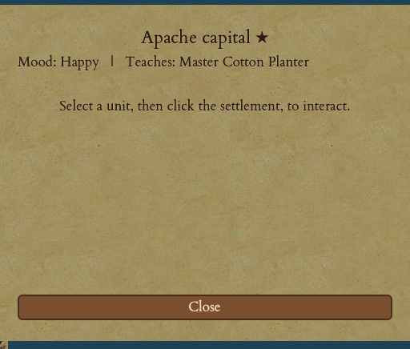

# Natives & Diplomacy

The New World is already inhabited. Long before your first sail comes over the horizon, the indigenous nations have built settlements across the map, and you discover them as you explore — a settlement you have never seen stays hidden under the fog. The natives are not simply enemies. Handled well they are teachers, trading partners and, in your war for independence, potential allies. Handled badly they become raiders who burn your frontier. This chapter is about that relationship, and about the parallel dance of war and peace you play with the [rival European powers](16-rival-powers.md).

<figure markdown="span">
{ width="380" }
<figcaption>Meeting a native settlement — its mood toward you and the expert skill it can teach a visiting colonist.</figcaption>
</figure>

## The eight nations

There are **eight** native nations, and they build three kinds of settlement:

| Settlement kind | Nations | Character |
|---|---|---|
| **Camps** | Apache, Sioux, Tupi | Small settlements |
| **Villages** | Arawak, Cherokee, Iroquois | Larger, better established |
| **Cities** | Inca, Aztec | Great settlements, strongly defended |

Each nation has a temperament of its own — some are naturally peaceful, others quick to anger. The Tupi, Cherokee and Inca tend to be easygoing; the Apache, Arawak and Aztec are aggressive. Each nation also has exactly **one capital** — bigger, better defended, and marked with a ★ on the map — plus a handful of ordinary settlements. Settlements never crowd each other and never spawn right on top of your landing site, so you always get room to settle.

Cities claim more land and defend harder than villages, and villages more than camps; a capital is tougher than any ordinary settlement of the same kind. Bear that in mind before you ever consider attacking one — the exact numbers live in the in-game Colopedia.

## Meeting a chief

Move a colonist next to a discovered settlement and you can **speak with its chief**. The first meeting with each nation is special: the chief tells tales of nearby lands (revealing the map around the settlement) and usually hands over a small gift of gold.

!!! tip
    First contact is counted **per nation** — each European power, you included, gets its own one-time audience with a given chief. A rival meeting "their" chief first doesn't use up your welcome. Send a proper **scout** rather than a plain colonist and you get much more from the visit — a scout can win a larger cache of gold, be trained on the spot, or reveal a wider stretch of map, and can return to a chief more than once. See [Units & Movement](05-units-movement.md).

## Learning skills for free

Every settlement quietly knows a **skill** it could teach a visiting colonist — expert farmer, expert fur trapper, and so on. Stand an ordinary colonist (a free colonist or an indentured servant) next to the settlement and you can have it **learn the skill**: the colonist trains into that expert for free, a shortcut around the cost and time of schooling ([Colonists, Professions & Education](09-colonists-education.md)).

An ordinary settlement teaches its one skill just **once**; a nation's **capital** teaches forever. Experts and petty criminals can't learn this way, and an **angry** settlement refuses to teach at all.

## Trading

Sail a ship loaded with goods next to a coastal settlement — or send a **wagon train** overland to an inland one — and you can trade both ways for gold, with **no European tax**.

- **Sell your cargo.** Each settlement most wants three particular goods and pays a premium for them (half as much again for its favourite). Bring what they crave and you'll do far better than at the European docks. Their wants shift over time, always pointing at whatever they most lack.
- **Buy from their store.** They gather raw goods from their land — sugar, tobacco, cotton, furs, ore — and their stock refills between your visits, so a settlement is a renewing source, not a one-off.
- **Haggle.** Name a price and the chief takes it, counters with his own, or (the longer you push) loses patience and breaks off the deal. When he accepts, the deal closes at *that* figure.

!!! tip
    The natives knock a fixed cut off what they'll pay a **ship**, reckoning a sea-trader is a middleman. An **overland wagon train** gets the better price for the same goods — and it's the only way to reach the inland settlements a ship can never touch. Every friendly exchange also cools the settlement's mood a little.

## Missions and converts

A colonist dressed as a **missionary** (or a trained Jesuit) can move onto a settlement and **establish a mission**. If the tribe is **Displeased or calmer**, the missionary moves in: the tribe warms to you, the land around is revealed, and from then on the mission slowly **wins converts** — every so often a brave leaves the settlement and walks into your nearest colony as a free **Indian Convert** worker. A Jesuit converts faster.

!!! warning
    If the tribe is already **Angry or Hateful**, they **kill** your missionary instead. Never preach to a tribe that hates you. There is only one mission per settlement — if a rival European already holds it, yours must **denounce** the rival's first, a gamble that can throw either missionary out.

A missionary can do more than preach. Standing at a settlement, he can **incite** the tribe against a rival European power — pay the chief and the whole tribe turns on that power, sending braves at the rival's colonies instead of yours. He can also help you buy land (below).

## Land — buying it or taking it

Each native settlement **owns the land around it**: the ring of tiles out to its reach belongs to that nation (a camp or village claims one tile out, a city two). This is their territory, and how you treat it is the single biggest lever on their mood.

When you found a colony **on** native-owned land, or put a colonist to **work** one of your colony's surrounding tiles that they own, the game stops and asks:

1. **Buy it** — pay a gold price the tribe sets, based on how productive the land is (richer land costs more). No anger.
2. **Take it by force** — free, but every settlement of that nation grows much more hostile toward *you specifically*.
3. **Abandon** — cancel the founding or the work order.

!!! tip
    Recruit the Founding Father **Peter Minuit** ([Founding Fathers](14-founding-fathers.md)) and native land becomes simply **free**, with no anger — a licence to expand across their territory unpunished.

## Mood, alarm and war

Every settlement keeps an **alarm** level toward you, on a ladder from **Happy → Content → Displeased → Angry → Hateful**. It starts peaceful and cools a little every turn, but hostile acts raise it fast. Crucially, a tribe judges each colonial power **separately** — the Cherokee can be your firm friends while seething at the Spanish next door.

What stirs a tribe up:

- **Attacking a brave** (their warriors) adds a lot of alarm; **killing** one adds far more.
- **Stealing land** angers every settlement of that nation.
- **Crowding them** — colonies and massed troops near their territory steadily raise alarm just by being there.

What calms them: friendly **trade**, a standing **mission**, and the simple passage of time. Some players have it easier — a **French** governor angers the natives only half as fast, a permanent national trait.

!!! warning
    Once a settlement turns **Displeased** or worse, its braves leave camp to **hunt your colonists and soldiers** and **raid your undefended colonies**, carrying off goods or gold. A well-armed tribe fields muskets, mounted braves and even native dragoons, and keeps coming over a long war. Angry braves may also **demand tribute** — pay for breathing room, or refuse and risk a raid. Push a whole nation past the top of the scale and it formally declares **war** on you.

**Keep the peace, or make it back:** garrison a soldier in any frontier colony (a defended colony can't be pillaged), build a **stockade** for extra protection, trade often, and give a tribe room. If a nation has gone to war, its anger cools over time on its own — war eases to an uneasy cease-fire and, once things calm right down, back to peace. Electing **Pocahontas** resets every tribe's alarm toward you to Happy at a stroke.

## Diplomacy with rival Europeans

You track a **stance** and a hidden grudge with every rival European power too, and the ladder mirrors the natives': **at peace → cease-fire → at war**. You start **uncontacted** with each rival; the first time either side sees the other, you become at peace, with no grudge.

- While at **peace** (or cease-fire, or allied), you simply **cannot** attack a rival, nor they you — the order is refused. You must **declare war** first.
- **Going to war** — by declaring it, by attacking an unmet stranger on sight, or by a rival breaking the peace — makes both sides hostile at once and spikes the grudge. Each turn the grudge cools, and the relationship follows it back down toward peace.

The **Diplomacy** screen (a button on the HUD, or a **scout** walking up to a rival's colony) lets you answer offers a rival has made and build treaties of your own — pay or demand gold, trade goods, hand over or demand colonies and units, incite them against a third power, or change your stance. Submit a deal and the rival accepts, rejects, or counters. You can also **declare war** outright, **trade at a rival's colony**, or **demand tribute** from one if your army dwarfs theirs.

The two systems come together at the end: the native nation you have wronged the most — and your standing with the rival powers — shapes who stands with you on the [road to independence](18-road-to-independence.md). For the wider picture of your neighbours, see [Rival European Powers](16-rival-powers.md); for how a fight actually plays out, see [Combat: Land & Naval](17-combat.md).
