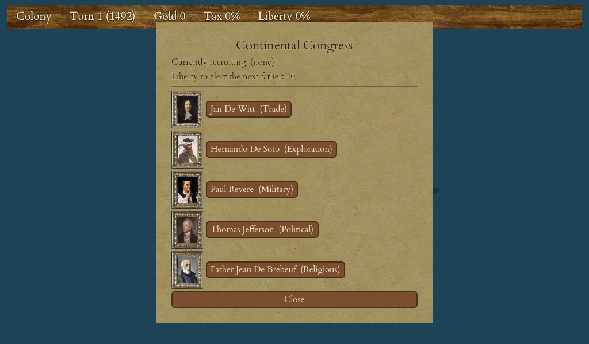

# The Road to Independence

Every colony you found begins as a loyal outpost of your mother country. Independence is not a button you press on a whim — it is the payoff of a long campaign to turn your colonists into revolutionaries. This chapter is about that campaign: how to grow rebel sentiment, what unlocks the fateful choice, and how to make sure that when you finally raise the flag you can survive the King's response.

<figure markdown="span">
{ width="720" }
<figcaption>Liberty bells recruit Founding Fathers and push your colonies' Sons of Liberty toward the 50% needed to declare.</figcaption>
</figure>

## Liberty bells and rebel sentiment

The fuel of the whole enterprise is the **liberty bell**, produced in your colonies' **town halls**. Staff a town hall with colonists (statesmen are the experts) and it rings out bells every turn. Those bells do two jobs at once:

- They raise each colony's **Sons of Liberty membership** — the share of that colony's population that has come over to the rebel cause. Everyone who hasn't come over is a **royalist** (a "Tory"), still loyal to the Crown.
- They accumulate nationally toward recruiting **Founding Fathers** into your Continental Congress (see [Founding Fathers & the Continental Congress](14-founding-fathers.md)).

The same bells feed both pools, so a colony that works its town hall hard is advancing your revolution *and* your congress at the same time.

### Membership changes how a colony works

Sons of Liberty membership isn't just a mood — it changes output. A colony's own workers respond to how they feel:

| Colony sentiment | Effect on each worker |
|---|---|
| 100% Sons of Liberty | **+2** to production |
| 50% or more (but under 100%) | **+1** to production |
| Comfortable royalist majority (a small colony) | no change |
| Too many royalists ("bad government") | **−1** to production |
| Far too many royalists ("very bad government") | **−2** to production |

So a fervent colony is a *more productive* colony, while a big colony crammed with loyalists actually works worse until the rebels win them over. This makes rebel sentiment a core economic lever, not just a war gate.

!!! tip
    A colony's screen shows a **Rebels · Population · Royalists** band with the membership percentage and current production bonus. Below the population count, a small hint reads "**+N room to grow**", "**−N overcrowded**", or "**at ideal size**" — it tells you how many colonists you can add before the bonus slips, or how many to shed to recover it. Watch it: a colony that grows faster than its bell output will see its membership fall.

Two buildings multiply your bell output when you can build them — the **printing press** and, above it, the **newspaper**. If you win **Thomas Jefferson** he boosts bells further, and **Simón Bolívar** raises Sons of Liberty across every colony at once. See [Buildings](11-buildings.md) and [Colonists, Professions & Education](09-colonists-education.md).

!!! warning
    Bells aren't free to keep. Beyond the first couple of colonists, each extra mouth in a colony quietly consumes a bell every turn. A large colony that stops staffing its town hall will *lose* membership over time. Growth without bells is how a proud rebel colony slides back into royalist grumbling.

## The gate: reaching fifty percent

Your **national** Sons of Liberty figure is what unlocks independence. It is the **plain average of your colonies' membership percentages** — every colony counts equally, whether it holds one colonist or twelve. A cluster of small, fervent colonies can carry your national figure just as well as one giant one.

To be allowed to declare independence, three things must all be true:

1. Your national Sons of Liberty is **at least 50%**.
2. You still hold at least one **port** (a coastal colony connected to the sea) — you'll need it to fight the war.
3. It is **not yet too late in history**. In the classic game the cut-off is the year **1800**; after that the mother country will no longer let a colony break away.

When all three hold, an **Independence** button appears among your on-screen controls. It stays hidden the rest of the time, so its arrival is your signal that the choice is now yours to make.

## Rising liberty provokes the King

There is a price for stoking rebellion, and it is quietly terrifying. The louder your bells ring and the more you defy the Crown, the more the King prepares to crush you. Throughout the game he adds ships and soldiers to a great army back home — the **Royal Expeditionary Force (REF)** — that will cross the ocean the moment you declare. The longer the game runs and the more you provoke him, the larger it grows. (Refusing a tax demand in a "tea party" surges your rebel sentiment but also further angers the Crown — see [The King, Taxes & Your Monarch](13-king-taxes.md).)

This creates the central tension of the endgame: **the same sentiment that unlocks independence also builds the army waiting to destroy you.** Racing your membership up as fast as possible summons a bigger REF; dawdling lets it grow anyway and risks the 1800 cut-off. Timing is everything.

!!! tip
    You can scout the enemy before committing. Open the **Reports** screen and find the **Expeditionary Force** tab — an intelligence read of the King's army *as it stands right now*, broken down by King's Regulars, dragoons, artillery, and men-o-war. The neighbouring **Military** tab shows your own strength. Compare the two before you pull the trigger.

## Preparing for the war before you declare

Declaring independence starts a war you cannot pause. Everything you'll fight it with must already be in your colonies, because the moment you declare, **Europe closes its doors** — anything you had waiting there or in transit is lost, and you can no longer recruit or buy from the mother country. Prepare while you still can:

- **Muskets and horses** in your warehouses, so colonists can be armed as soldiers and mounted as dragoons on the spot (see [Units & Movement](05-units-movement.md)).
- **Artillery**, built at your colonies or bought before the doors shut — your hardest-hitting land units and best colony defenders.
- **Fortifications** — stockades and forts around your ports, so the King's regulars break themselves on your walls (see [Managing a Colony](08-managing-colony.md) and [Combat: Land & Naval](17-combat.md)).
- **Veteran soldiers** stationed in your most fervent colonies — because of what happens the instant you declare.

When you do declare, several things fire at once. In each fired-up colony (over half rebels), some of the **veteran soldiers garrisoned there rise up as Continental regulars** — the bigger and more fervent the colony, the more of its veterans muster, so stacking veterans in high-membership ports pays off directly. The **loyalists desert you**: a colony that never really came round loses a chunk of its people, while a wholly rebel colony loses none — another reason to push membership high before declaring. The native nation that most resented the old Crown **comes over to your side**, while the angriest tribe not already fighting you may turn against your young nation. And the King makes **one parting offer of mercenaries** — a fixed force of professional Hessians you may hire for gold, including (if you can afford them) a pair of men-o-war to contest the seas. Take the offer or leave it; you're only charged if you accept.

!!! warning
    Recruiting Founding Fathers **stops** the moment you declare — the Continental Congress closes and you elect no new fathers for the rest of the game. The fathers you've already won keep all their benefits, so win the ones you want (Washington, Jefferson, Bolívar, and any military fathers) *before* you raise the flag.

## Choosing the moment

There is one more reason not to wait: **the earlier you break away, the bigger the bonus to your final score.** Declaring well ahead of the historical date is worth more points than clinging on to the last moment (see [Winning the Game & Scoring](20-winning-scoring.md)).

Putting it together, the ideal moment to declare is when:

- your national Sons of Liberty has cleared 50% (comfortably, so it holds through the loyalist exodus);
- your ports are fortified, garrisoned with veterans, and stocked with muskets, horses, and artillery;
- your **Military** tab shows a force that can stand against the **Expeditionary Force** tab;
- you've secured the Founding Fathers you need; and
- it's early enough to bank a healthy score bonus — and, above all, before 1800.

When you're ready, press the Independence button, name your new nation, read the consequences one last time, and choose **"Liberty or Death!"** What happens next — the King's army coming ashore, the foreign ally who may come to your aid, and how to actually win — is the subject of [The War of Independence](19-war-of-independence.md).
