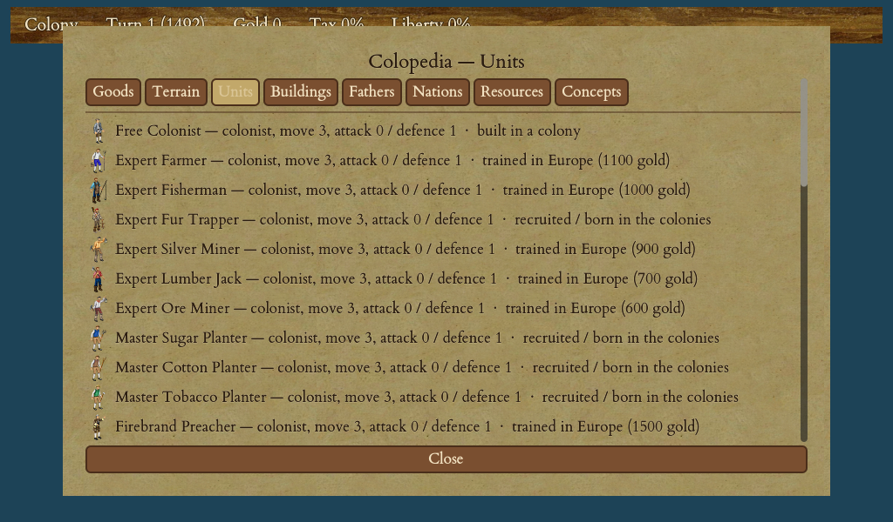

# The War of Independence

You have spent the whole game building toward this: colonies fat with rebels, a standing army, and a name ready for a new nation. This chapter covers the moment you break away and the war that follows. If you have not yet reached the point of declaring, read [The Road to Independence](18-road-to-independence.md) first.

<figure markdown="span">
{ width="720" }
<figcaption>The Colopedia lists the King's Regulars, men-o-war and your own regulars — the armies of the war.</figcaption>
</figure>

## Declaring: Liberty or Death

Once your colonies average at least **50% rebel support** (the plain average of each colony's Sons-of-Liberty level, big or small) and you hold at least one **port**, an **Independence** button appears among your controls. There is one more condition: it must not yet be too late in history. After a **last colonial year** — the year **1800** in the classic game — the mother country will no longer let a colony break away, and the button never appears.

Pressing it opens the **Declaration of Independence** screen. You can **name your new nation** (a text box pre-filled with your usual name — the *United States*, or whatever you like), read your current rebel sentiment and the consequences, then choose **"Liberty or Death!"** or **"Maybe Later."** Maybe Later changes nothing. Liberty commits you — and from that instant several things happen at once:

- **Europe is lost and closed.** Everything you had waiting there, and every unit at sea bound for the New World, is seized. No more recruiting or trading with the mother country.
- **The Continental Congress closes.** You elect **no new Founding Fathers** after declaring — but every father you already hold keeps working (more on that below).
- **Loyalists desert you.** In each colony, some of the colonists who never came round to the rebellion — the "Tories" — pack up and leave rather than fight their King. The **less committed a colony was, the more of them go**; a colony of fervent rebels loses no-one, and no colony is ever emptied.
- **Continental regulars muster.** In each fired-up colony (over half rebels), some of the **veteran soldiers stationed there rise up as Continental regulars** — the bigger and more fervent the colony, the more of its own veterans answer the call.
- **A native nation joins you.** The tribe that liked you most (among those whose chiefs you have met) **backs the new nation** and turns hateful toward the King's army. Meanwhile the angriest tribe not already fighting you declares war on your young nation. A tribe you have never met stays out of it.
- **The King makes one parting offer** of Hessian mercenaries you may hire (see below).
- **The Royal Expeditionary Force sails in** to crush the rebellion.

!!! tip
    **The earlier you break away, the bigger the bonus to your final score.** Declaring well before the historical date (around 1780) is worth more points than waiting until the last moment. Balance that reward against the fact that the King's army grows all game — a late declaration faces a bigger REF. See [Winning the Game & Scoring](20-winning-scoring.md).

### Your fathers keep fighting

The Congress shuts its doors, but the fathers you have already won keep their effects. Two matter enormously now. **George Washington** promotes **every unit that wins a battle** — a raw recruit who survives the war can climb to a veteran and beyond, so each victory over a redcoat strengthens your army. Thomas Jefferson keeps boosting your bells, and so on. See [Founding Fathers & the Continental Congress](14-founding-fathers.md).

### The King's mercenary offer

The King makes a one-off offer of professional **Hessian mercenaries** — armed and mounted veteran soldiers, artillery, and, if you can afford them, **two men-of-war**, so a rich rebel can buy itself a navy to fight the King's fleet at sea. You accept or decline; nothing is forced on you, and you are never charged unless you say yes. If your treasury is too thin, the King quietly drops the dearest units — the men-of-war first — until what remains is something you can pay for.

## Facing the Royal Expeditionary Force

The whole force the King has amassed musters in Europe at the declaration, so it counts in full when you weigh your chances. Before you commit, scout it: the **Reports** screen has an **Expeditionary Force** tab showing the army as it currently stands, broken down by type.

The REF is built of four kinds of unit:

| Unit | Role |
|---|---|
| King's Regulars (infantry) | The backbone of the assault |
| King's Regulars (cavalry) | Faster, harder-hitting attackers |
| Artillery | Powerful against your fortifications |
| Men-of-war | Hunt your ships and support the landings |

### How it lands

The army does **not** hit the beach all at once. It comes ashore in **successive waves** — only about a third of the soldiers land in the first echelon, the rest following over the next several turns. So you cannot simply repel one big landing; fresh redcoats keep arriving as the war drags on. The **first** time the King's army comes ashore you get a one-off warning message naming the colony nearest the landing; the later waves do not re-warn.

The REF fights with a single-minded plan. Its soldiers go straight for your **coastal ports first** (to cut you off from any foreign ally), and the **weakest-defended** of those before the well-fortified ones. It deliberately **ignores your loose troops in the field until it has actually captured one of your colonies** — the King wants your towns, not a scattered chase. His men-of-war hunt your ships and, when none are near, sail in to support the landings.

### Fighting back

You beat the REF by **attrition** — grinding it down faster than it can take your colonies.

- **Defend your ports.** They are the King's targets and your lifeline to a foreign ally. Concentrate your best defenders there.
- **Lean on popular support.** The more of a colony's people are committed rebels, the harder it fights off the Crown. Keep your Sons-of-Liberty high right through the war.
- **Use terrain and fortifications.** A **fortress** and dug-in, fortified defenders turn a colony into a wall the redcoats break against. A REF unit caught in concealing forest or hills can also be **ambushed**, just as a war party ambushes a colonist. See [Combat: Land & Naval](17-combat.md).

!!! warning
    The REF gets a **+50% bonus when assaulting a settlement**, so it can take a colony an ordinary raider could not. Do not leave a port thinly held on the assumption its stockade will save it — meet the King with a real garrison.

### A foreign ally comes to your aid

The longer and harder you fight, the closer a sympathetic foreign power comes to committing. Every bell your rebellion produces during the war counts toward a hidden tally; cross the threshold and the ally lands a small **Intervention Force** — a couple of colonial regulars, some dragoons, artillery, and men-of-war — right beside one of your ports, fighting on your side. The men-of-war arrive offshore with the troops aboard, so the ally can reach even a **besieged** port. The tally then resets, and **each wave is bigger than the last**: hold out for years and progressively larger landings arrive. Stubbornness is rewarded — you will not face the King alone forever.

## Winning and losing

**You win** when you break the King's resolve. The King is not endlessly stubborn: as you destroy his expeditionary force his **morale erodes**, and once you have broken about **three-quarters** of the army he committed — and his survivors have dropped below a credible fighting strength — his morale fails. The surviving redcoats lay down their arms, the fleet sails home, and you have won your independence, even if neither side is a clear victor.

**You lose** the war if the King takes your **last port**. Keep at least one port in your hands and the war is never over.

Winning the War of Independence is the headline victory and multiplies your final score — the sooner you win, the bigger the bonus. For the alternative victory conditions (last European power standing), retiring, and "Keep Playing," see [Winning the Game & Scoring](20-winning-scoring.md).
