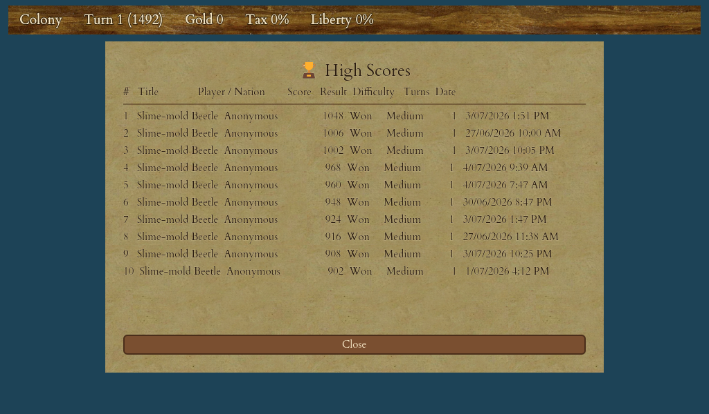

# Winning the Game & Scoring

Every game of *Crown & Colony* is heading somewhere. You can play for years of in-game time as a peaceful trader, a conqueror of native cities, or a single-minded revolutionary — but sooner or later the game ends, a final score is tallied, and your name (or something less flattering) is written into the high-score table. This chapter explains how to win, how to lose, and exactly how your score is added up.

<figure markdown="span">
{ width="720" }
<figcaption>Your best games, ranked and recorded at the end of each — the hall of fame.</figcaption>
</figure>

## How to win

There is no single scripted path to victory. What counts as a "win" depends on which victory conditions were switched on when you set up the game (see [Starting a New Game](02-new-game.md)), but the headline goal is always the same.

### Win the War of Independence (the main victory)

This is the game's centrepiece. To get there you must:

1. Rally your people until at least **half of all your colonists are rebels** — your national Sons of Liberty membership reaches **50%**. Bells from your town halls drive this; see [Founding Fathers & the Continental Congress](14-founding-fathers.md) for the political engine behind it.
2. Hold a **port** colony, and act before history runs out (the classic cut-off is the year **1800**).
3. **Declare independence** — the details of that moment are covered in [The Road to Independence](18-road-to-independence.md).
4. Survive and win the war that follows. The King's **Royal Expeditionary Force** sails in to crush you; you win by defeating or driving it off and securing your freedom.

The full campaign — the landings, the coastal defence, and the allied foreign power that eventually joins you — is covered in [The War of Independence](19-war-of-independence.md).

### Last European power standing (optional victory)

If you enabled it at setup, you can also win by being the **last European power standing** — every rival's colonies and armies wiped out. See [Rival European Powers](16-rival-powers.md). A separate "last human standing" condition exists for multiplayer and is off by default in the classic single-player game.

## How you lose

- **You lose the War of Independence** if the King takes your last port.
- More generally, a game is **lost** if you run out of colonies and units — your presence in the New World is extinguished.

Either way, the game ends, your final score is locked in, and it is written to the high-score table alongside your wins.

## How your score is tallied

Your **score** is a single number that rates how well your empire is doing. You never set it directly — the game adds it up from what you own and what you have achieved, and it changes turn by turn as your nation grows. It is drawn from these ingredients:

| Ingredient | How it counts |
|---|---|
| **Your units** | Every colonist, soldier, ship and wagon you own is worth a few points — better units are worth more, and a plain colonist is worth less than an expert. **Colonists working inside your colonies count too**, at the same value they would have standing on the map. |
| **Banked liberty** | Each colony adds its stored liberty (the bells that drive Sons of Liberty) straight to your score. A fervent, bell-rich colony is worth a great deal. |
| **Founding Fathers** | Each Founding Father you elect to the Continental Congress adds a small fixed number of points. |
| **Gold** | Your treasury converts to points at a very low rate — thousands of gold for a single point. Money is deliberately the weakest contributor. |
| **First-discovered regions** | The first time you reveal a region nobody has reached, you earn its exploration points — larger regions and mountain ranges are worth more; see [Exploration & Discovery](06-exploration.md) and [The Map & Terrain](04-map-terrain.md). |

!!! warning "Razing settlements costs you points"
    Burning a native settlement is treated as an atrocity: you **lose points** for each one you raze, and you lose a much larger penalty if that razing wipes out a native nation's very last settlement. A destruction-heavy game can genuinely drag your score down. The plunder you seize is separate — it adds to your gold — but the act of destruction is a black mark on your record.

!!! tip "Finding a City of Gold is remembered, not scored"
    Stumbling on one of the fabled Seven Cities of Gold is noted in your history, but the find itself adds no points. Its worth flows through the **treasure** it hands you, which becomes gold once you cash it in.

### The win multiplier — sooner is bigger

Winning the War of Independence multiplies your **whole score** by a percentage bonus, and being first pays the most:

| Finish | Bonus to your final score |
|---|---|
| First nation to win independence | Your score **doubles** (+100%) |
| Second nation | +50% |
| Third nation | +25% |

Because the bonus multiplies everything you have earned, a strong, early independence victory is worth far more than a slow, grinding one. In the classic single-player game you are the one making the break, so an independent nation takes the top bonus.

There is a further reward for haste woven into the score: **declaring independence earlier in history earns bonus points** — the earlier you break away, the larger that bonus. Waiting until the last possible year earns nothing extra.

## The end-of-game breakdown and the high-score table

When the game ends — whether you win by defeating the King's army or lose your last port — the **end-of-game screen** appears and shows your final score **broken down line by line**, so you can see exactly why it came out where it did: how much came from your people, your liberty, your Fathers, your gold, your discoveries, any penalties, and the independence multiplier on top.

Your finished game is then recorded on the **high-score table**, which keeps your best completed games with the best score first. Each entry shows:

- an **honorific** the score earned — a grand score names a *continent* after you, a tiny one brands you a lowly creature, following the game's whimsical naming ladder;
- your **nation**;
- your **score**;
- whether you **won or lost**;
- the **difficulty** you played on;
- how many **turns** the game ran;
- and the **date** you played it.

The high-score table is stored completely separately from your saved games, so finishing a game never disturbs a save, and your record of past triumphs survives even if you delete every saved game. If you improve on the same game's score, the better result replaces the earlier one rather than listing it twice.

## Playing for score

Even if independence is your goal, it pays to remember what the score rewards: a large, expert population; colonies overflowing with liberty; a full Continental Congress; regions you were first to explore; and — above all — an early, decisive independence win to double it all. For a fuller playbook, see [Strategy & Tips](21-strategy.md).
