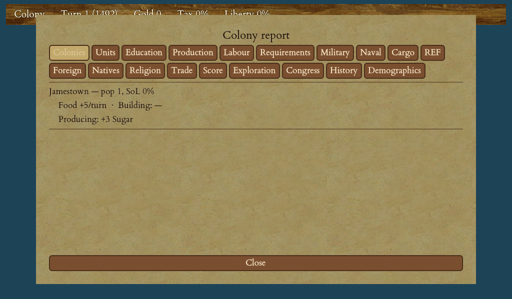

# Strategy & Tips

You have read how every system works. This chapter is about putting them together: how to open a game, how to build an economy that funds a revolution, and how to time your bid for independence so the King's army does not simply roll over you. None of it is compulsory — Crown & Colony rewards traders, conquerors and revolutionaries alike — but the advice below will keep you out of the potholes that sink most first games.

<figure markdown="span">
{ width="720" }
<figcaption>A one-screen overview of every colony's people, production and needs — invaluable for steering an empire.</figcaption>
</figure>

## Opening moves

Your very first turns decide the shape of your empire, and the biggest mistake is settling the first tile you land on.

- **Scout before you commit.** Spend a turn or two sailing along the coast and looking at what the land offers before you press `B`. You are choosing where your capital's eight surrounding tiles will be for the whole game — a spot with a mix of good food, a cash crop (tobacco, cotton, sugar or furs) and a hill or two for ore is worth the short delay. Coastal is almost always better than inland: a port can build [docks and a shipyard](11-buildings.md), trade directly with a ship, and later defend against — or flee — the King's navy.
- **Get one cash crop to Europe early.** Your treasury starts near empty, and gold buys everything: recruits, tools, artillery, ships. Pick one raw good your first colony produces well, ship a load to Europe, and sell it. That first sale funds your first bought colonist or your first tools. See [Trade & the Europe Screen](12-trade-europe.md).
- **Meet your neighbours.** Sending a colonist out as a scout (arm it with horses) to visit native settlements usually earns a gift of gold and reveals the map cheaply — see [Natives & Diplomacy](15-natives-diplomacy.md). A scout also never vanishes when investigating a [lost-city rumour](06-exploration.md).

## Building an economy

A colony that tries to do everything does everything badly. The economy chapters ([Goods & Production Chains](10-goods-production.md), [Managing a Colony](08-managing-colony.md)) explain the machinery; the strategy is **specialisation**.

- **Give each colony one chain.** A production chain is a raw good turned into a finished product by a building. Pick one per colony and staff it end to end:

| Colony's job | Gatherers work | Crafters turn it into |
|---|---|---|
| Cloth town | Cotton | Cloth (weaver) |
| Rum town | Sugar | Rum (distiller) |
| Cigar town | Tobacco | Cigars (tobacconist) |
| Coat town | Furs | Coats (fur trader) |
| Tool & gun town | Ore | Tools, then muskets (blacksmith, gunsmith) |

- **Match gatherers to crafters.** A single distiller consumes a set amount of sugar each turn. Put enough colonists on sugar tiles to feed him and no more — surplus sugar just piles up and eventually spills over your [warehouse cap](08-managing-colony.md). Watch the colony's production overview: you want raw production and consumption roughly balanced.
- **Educate your experts.** An expert produces far more than a plain colonist. Buy a few, or better, build a [schoolhouse](09-colonists-education.md) and station an expert in it to teach your own — this mass-produces specialists at home instead of paying Europe's ever-rising recruit prices. Experts pay off most in upgraded workshops, where their bonus is amplified.
- **Automate the hauling.** Once you have a few colonies, clicking cargo around by hand is a chore. Set up **trade routes** (colony → colony → Europe) so ships and wagon trains haul and sell on their own every turn. Later, [Peter Stuyvesant](14-founding-fathers.md) unlocks the **custom house**, which auto-sells your surplus straight from the colony with no ship at all — the endgame of a hands-off economy.

## Liberty bells versus the economy

Every colonist you put in the town hall makes liberty bells but grows no food and no goods. This is the central tension of the game, and there is no fixed right answer — only a rhythm.

- Bells do two jobs: they raise a colony's [Sons of Liberty](18-road-to-independence.md) membership (which gives a **production bonus** at 50%+ and again at 100%), and they accumulate toward [Founding Fathers](14-founding-fathers.md). Early bells are an investment that pays back as faster production and powerful fathers.
- **Do not let a colony outgrow its bells.** Every colonist past the first two eats a bell each turn. A colony that grows fast while its town hall sits half-staffed will see its membership *fall*, dragging production down and stalling your father elections. The colony screen shows a "room to grow / overcrowded" hint — heed it.
- A practical pattern: found a colony, get its cash-crop chain running to fund itself, *then* staff the town hall to push membership toward 50% for the free production bonus. Chase [Thomas Jefferson](14-founding-fathers.md) (a big bell boost) as an early father if you mean to declare.

## Planning a colony network

Think of your colonies as a network, not a scatter of towns. Colonies cannot be founded touching each other, so plan spacing. Cluster them so a wagon train can move a gatherer town's raw goods to a crafter town in one hop, and keep at least one strong **port** that can build ships and stand a siege — the King attacks ports first.

## Avoiding a two-front war

The surest way to lose is to be fighting the natives *and* a rival while the King's army is landing.

- **Keep the natives calm.** Buy the land you settle rather than taking it by force, trade fairly, and avoid crowding their settlements. An angry nation sends braves to raid you at the worst possible moment. [Pocahontas](14-founding-fathers.md) resets and permanently dampens native alarm if diplomacy alone is not enough.
- **Manage rivals.** Make peace with European powers before you declare, so you face only one enemy. [Benjamin Franklin](14-founding-fathers.md) stops the King dragging you into wars on his behalf and makes rivals accept your peace — invaluable in the run-up to independence. See [Rival European Powers](16-rival-powers.md).

## Timing the Declaration

You may declare once your national Sons of Liberty reaches **50%** and you hold a port. *Reaching* 50% is not the same as being *ready*.

!!! warning "Do not declare before you are armed"
    Declaring closes Europe forever — no more recruiting, no more buying muskets, artillery or ships. Everything you have not already brought across the ocean is lost the moment you sign. Arm your colonies **before** you declare, never after.

Before you declare:

1. **Arm up.** Stockpile muskets and horses and turn colonists into soldiers and dragoons. Build artillery. A high-membership colony rises with Continental regulars when you declare — the more fervent your colonies, the more veterans you keep.
2. **Fortify your ports.** Build stockade → fort → fortress in the ports the King will strike first. Defenders dug into a fortress are hard to dislodge.
3. **Watch the clock, but not too closely.** The [Royal Expeditionary Force](13-king-taxes.md) grows the longer the game runs and the more you provoke the Crown — so an endless build-up faces an endless army. Declaring earlier means a smaller enemy and (because a fast win multiplies your score) a bigger reward. Balance readiness against the swelling REF, and remember the classic cut-off: you cannot declare after 1800. See [The Road to Independence](18-road-to-independence.md) and [The War of Independence](19-war-of-independence.md).

## A note on difficulty

The game offers five classic difficulty levels, from the gentlest to the harshest. Higher levels mean more interference from the King, costlier recruits and a tougher Royal Expeditionary Force. If you are new, start low: a gentle King and a small REF give you room to learn the economy before the war. On harsher levels, lean harder on **home-grown experts** (recruits are dear), keep your **tax-provoking to a minimum**, and start your **military build-up earlier**, because the army you must beat is that much larger.

## Common beginner mistakes

!!! tip "The five that sink most first games"
    - **Negative food.** A colony that eats more than it grows starves — assign enough food tiles before you chase cash crops. In a normal classic game a lone colonist always feeds itself, but a growing colony can outrun its food.
    - **Crashing a price.** Dumping 600 of one good on Europe collapses its price as you sell. Spread big sales out, or trade several goods, so you keep selling at a good rate. (The Dutch feel this half as much — see [Trade & the Europe Screen](12-trade-europe.md).)
    - **Overcrowding.** A colony grown far past its bell output turns royalist, loses its production bonus, and sulks. Grow to match your bells.
    - **Declaring before arming.** Covered above — the single most common way to lose the war on the first turn of it.
    - **Fighting on two fronts.** Make peace and calm the natives *before* you take on the King.

Exhaustive numbers — exact yields, costs and prices — live in the in-game **Colopedia** (press `C`). This chapter is the shape of a winning game; the Colopedia is the ledger behind it.
