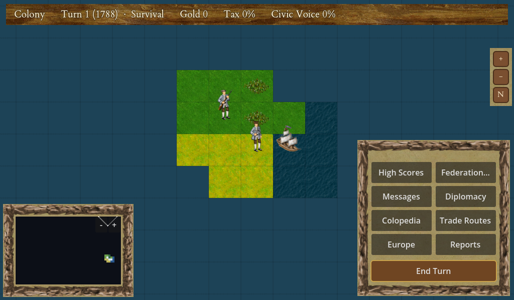
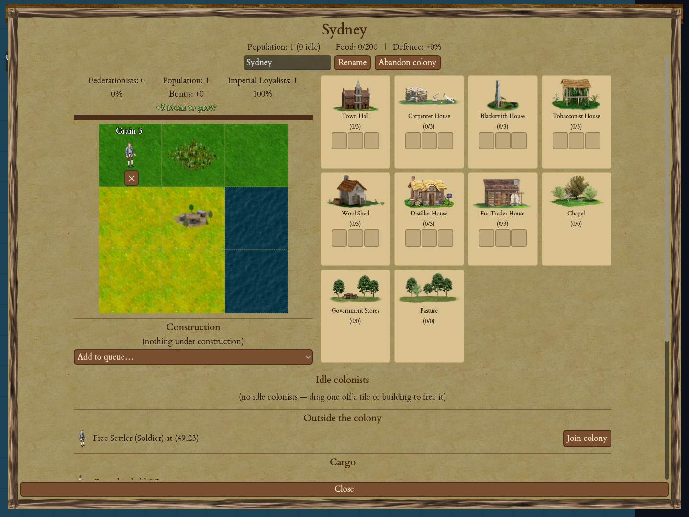
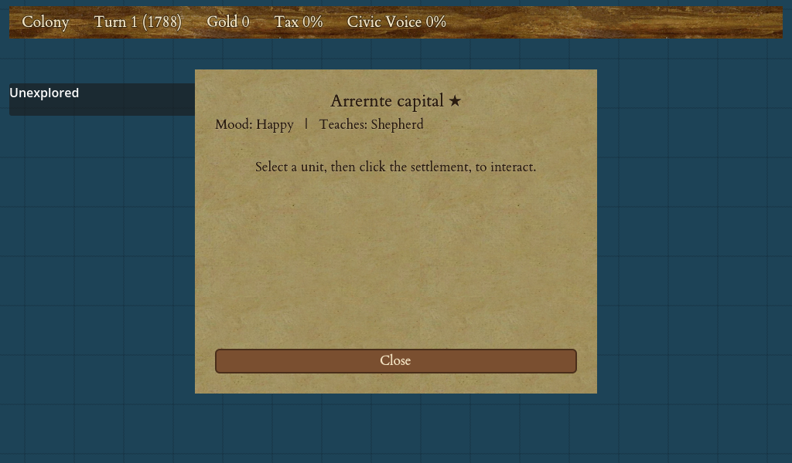

# The Australian Federation

Crown & Colony can tell more than one story. The one you have read about so far is *Colonial America* — the classic 1492 game. This chapter is about the second: the **Australian Federation**, a campaign that moves the whole game to the far side of the world and swaps the war of independence for a very different ending — six British colonies growing, arguing, and eventually **federating** into a single nation.

If you have played the American game, everything here will feel familiar. You still land settlers, found colonies, work the land, build up an economy, and rally your people around an idea. Only the *dressing* changes: the year is 1788 instead of 1492, the continent is Australia, your export is **wool** instead of cotton, your windfall is **gold** instead of silver, and the great cause is not breaking from the Crown but joining the colonies together.

!!! info "This is a work in progress — and this chapter is honest about it"
    The Australian Federation is under active development. A lot of it is **playable today** — you can start a game, found Sydney, meet the First Nations, recruit Australian Pioneers, and read every screen in Australian language. But the deep, headline systems — the Federation-victory loop, the full First Nations diplomacy model, and the branching historical events — are **still being built**. Throughout this chapter, anything not yet in the game is clearly marked with an **"In development"** note, so you always know what you can do now versus what is coming.

<figure markdown="span">
{ width="760" }
<figcaption>Turn 1, the year 1788. Your First Fleet has arrived. Note the top bar: <strong>Gold</strong>, <strong>Tax</strong>, and <strong>Civic Voice</strong> — the Australian names for the money, the King's cut, and your people's political voice.</figcaption>
</figure>

## What the mode is

In 1788 the **First Fleet** — eleven ships carrying convicts, marines and stores — landed at Sydney Cove and founded Britain's first permanent settlement on the Australian continent. Over the next century that single toehold grew into **six separate British colonies**, each with its own government, its own economy and its own opinions. In 1901 those six colonies **federated** into the Commonwealth of Australia.

That is the arc the Australian Federation campaign follows: **from the First Fleet of 1788 to Federation in 1901.** You begin with a handful of settlers on an unfamiliar coast and, over a long game, build the colonies, the economy, the infrastructure and the political will that carry you to the founding of a nation.

The single biggest change from the American game is the **goal**. There is no King's army to defeat here. Instead of declaring independence and winning a war, the intended endgame is to build support for Federation colony by colony until the Commonwealth can be proclaimed.

!!! warning "In development — the Federation-victory endgame"
    The full Federation victory — building Federation Support in each colony, convening a Federation Convention, drafting a constitution and holding referendums — is **designed but not yet playable as a complete loop**. You can start and play an Australian game today, but you cannot yet *win it by Federation*. See [The goal — Federation](#the-goal-federation) at the end of this chapter for what is intended and what exists now.

## Getting started

Starting an Australian game is exactly like starting any other — you just pick a different scenario.

1. From the title screen choose **New Game**.
2. In the setup panel, open the **Scenario** dropdown at the top. It lists two worlds: *Colonial America (Classic)* and **Australian Federation**. Choose **Australian Federation**.
3. Set the other options if you like — difficulty, world size, and so on all work the same as in the [classic New Game panel](02-new-game.md) — then press **Start**.

That is the only change. Everything else on the setup panel behaves as described in [Starting a New Game](02-new-game.md).

When the game begins, a short **opening intro** plays — but the Australian one, not the American. Instead of the 1492 charter and ocean crossing, you get a sober telling of the First Fleet's 1788 arrival, the hard early penal years, the spread into six colonies, and the road to Federation. As always, a click advances it and **Skip ▸** or **Esc** ends it; you can turn the intro off entirely in **Settings → Game**.

Then the map appears on **turn 1, in the year 1788**. You will see the top bar count the years forward from there toward 1901.

### Where you start

Your first settlers land on the coast of **New South Wales**, and your first colony is founded as **Sydney** — the First Fleet's historical landing at Sydney Cove. Found it, and you have your beachhead on the continent.

<figure markdown="span">
{ width="760" }
<figcaption>Sydney, your first colony. The building names read in Australian terms — <strong>Government Stores</strong>, <strong>Wool Shed</strong>, <strong>Pasture</strong> — and the loyalty header shows <strong>Federationists</strong> and <strong>Imperial Loyalists</strong> instead of the American Rebels and Royalists.</figcaption>
</figure>

!!! note "In development — choosing which colony to begin in"
    The design gives the campaign a second layer of replayability: starting your game in any of the **six colonies**, not just New South Wales — landing at Swan River in Western Australia, or on the southern island of Tasmania, and so facing a different frontier. The **engine already knows how to do this** (the six colony start points are defined and tested), but the New-Game screen does not yet offer a **Colony** dropdown to pick between them. For now every Australian game begins at **Sydney Cove in New South Wales**, the historical default. The chooser is a planned addition.

## The six colonies

Federation, when it comes, joins six British colonies. On the authored Australia map these six are marked as **named regions**, so the land itself reads as the historical colonies you are working to unite:

| Colony | Where | First settled | Historical flavour |
|---|---|---|---|
| **New South Wales** | The east coast, around Sydney | 1788 (First Fleet) | The original penal settlement; later the political centre. Your starting colony. |
| **Victoria** | The south-east, around Port Phillip | 1830s | Gold-rush powerhouse; heavy immigration and democratic pressure. |
| **Queensland** | The north-east, around Moreton Bay | 1820s–50s | Distance and pastoral expansion; tropical resources. |
| **South Australia** | The centre-south, around Adelaide | 1836 | A free-settlement colony — planning, reform and agriculture, no convicts. |
| **Tasmania** | The southern island (Van Diemen's Land) | 1803 | Island logistics; a harsher frontier history. |
| **Western Australia** | The far west, around Swan River | 1829 | Remote and thinly populated; a late, hesitant joiner to Federation. |

You will not settle all six at once — like any Colonization game, you expand outward from your first foothold. But the map names them from the start, so you always know which colony's Country you are moving into.

!!! tip "Australian town names"
    When you found colonies, the game draws on a historically-ordered list of Australian place names, **Sydney first**: Sydney, Parramatta, Newcastle, Hobart, and onward. Your growing map fills with real colonial towns rather than the American Jamestown and Plymouth.

## The Australian economy

The economy is the American economy in Australian dress. The *rules* are unchanged — a colony still works tiles, produces raw goods, and refines them — but the **names** are Australian, and two of the classic staples are reimagined.

The two headline reskins:

- **Wool** replaces cotton. Wool is the pastoral export that built colonial Australia — the merino sheep that arrived in the early years turned the inland into one giant sheep run. Wherever the American game would say "cotton", the Australian game says **Wool**.
- **Gold** replaces silver. The 1850s gold rushes are the great windfall of Australian history, drawing hundreds of thousands of migrants. Wherever the American game would say "silver", the Australian game says **Gold**.

The rest of the goods keep their everyday names — food, grain, fish, ore, tools, horses, and so on all read as before. And your people's political output — the "liberty bells" of the American game — is renamed **Civic Voice**. You will see **Gold**, **Tax** and **Civic Voice** on the top bar of the world map from turn one.

### The colony screen in Australian terms

Open a colony and the screen is the familiar one, but several buildings now carry Australian names:

| You'll see | In the American game it's | What it does |
|---|---|---|
| **Government Stores** | the depot / warehouse | Your colony's store of goods — the ration buffer a young penal settlement lived out of. |
| **Wool Shed** | the weaver's house | Turns wool into cloth — the first tier of textile work. |
| **Shearing Shed** | the weaver's shop | The larger, upgraded wool works. |
| **Pasture** | the pasture | The grazing tile where your sheep and cattle feed. |

The specialists who work these are renamed too: the wool grower is a **Shepherd** and the gold miner a **Digger**. Your ordinary people are Australian as well — a petty criminal is a **Convict Labourer**, an indentured servant an **Emancipist** (a convict who has served their term), and a free colonist a **Free Settler**.

!!! note "In development — the rest of the building names"
    Only some buildings have Australian names so far. In the colony screen today you will still see several classic names — **Tobacconist House**, **Fur Trader House**, **Distiller House**, **Blacksmith House**, **Chapel** — because the goods they process have not yet been reskinned. The design calls for a fuller set of Australian buildings (Sheep Station, Cattle Station, Freezing Works, Goldfields Office, Telegraph Office, and more), but those are not in the game yet. What you see now is a first, partial pass; expect more Australian names as development continues.

## Australian Pioneers

The American game has its Founding Fathers — famous figures you recruit into the Continental Congress, each granting a lasting bonus. The Australian Federation has its **Australian Pioneers**, and they work in exactly the same way: you accumulate **Civic Voice**, and when you have banked enough, the Pioneer you have chosen joins your **Federation Convention** (the Australian name for the electing body).

There are **25 Australian Pioneers**, five in each of five walks of life. Each round you are offered one candidate from each category and choose who to pursue; they are elected the turn your banked Civic Voice reaches their cost. The more Pioneers you already hold, the more Civic Voice the next one costs — so they are a long-game investment, just as the Fathers are.

The five categories, and a taste of who you will meet:

| Category | The idea | A few of the Pioneers |
|---|---|---|
| **Industry & Commerce** | Wool, gold, trade and pastoral wealth | **Elizabeth Macarthur** (the merino-wool economy), Thomas Sutcliffe Mort (refrigerated meat), **Edward Hargraves** (the gold rush), Sidney Kidman (the great pastoral runs), George Fife Angas |
| **Exploration & Infrastructure** | Charting the continent and wiring it together | **Matthew Flinders** (who mapped the coast), Charles Sturt, Ludwig Leichhardt, John McDouall Stuart, Charles Todd (the Overland Telegraph) |
| **Settlement, Administration & Defence** | Survival, order and the growth of towns | **Arthur Phillip** (the first Governor), Lachlan Macquarie (the great builder), James Ruse (the first successful farmer), Mary Reibey, William Jervois |
| **Democracy & Federation** | The road to Federation itself | **Henry Parkes** (the "Father of Federation"), Edmund Barton, John Quick, Samuel Griffith, Catherine Helen Spence |
| **Social Reform & First Nations** | Immigration, reform and relations on the frontier | **Caroline Chisholm** (who championed assisted immigrants and family settlers), Peter Lalor (the Eureka Stockade), Mary Lee, Louisa Lawson, **William Barak** (the Wurundjeri leader and advocate) |

Because these are the *same machinery* as the Founding Fathers, each Pioneer's bonus is a familiar effect wearing an Australian coat: James Ruse hands you a free expert farmer; Charles Todd boosts your Civic Voice; William Jervois grants your colonies a free defensive work; Caroline Chisholm shapes who steps off the immigrant boat. William Barak's effect calms tension with the First Nations — but, in keeping with the mode's tone, without the "conquest" flavour some American fathers carry.

!!! tip "The right Pioneers come in the right era"
    You will not be offered the **Democracy & Federation** figures early on — a Henry Parkes campaigning for Federation in 1800 would be an anachronism. The game gates them to the later years, so the Federation figures appear only as the century turns and the real Federation movement gathers. Early on you will be offered survival, exploration and economy figures instead.

## Civic Voice, Federationists and Imperial Loyalists

Two political ideas from the American game are reskinned for Australia.

**Civic Voice** is the renamed liberty. Your town halls produce it, it accumulates for your nation, and you spend it electing Australian Pioneers. It stands in for the "liberty bells" and "liberty" of the American game — the same production, the same accrual, a new name. You will see your national **Civic Voice %** on the world-map top bar.

Inside each colony, the two political factions are renamed too. Where the American game splits a colony's people into **Rebels** (Sons of Liberty) and **Royalists** (Tories), the Australian game shows:

- **Federationists** — the people who favour joining the colonies together (the reskinned Sons of Liberty).
- **Imperial Loyalists** — those who would rather stay as they are, loyal to the imperial arrangement (the reskinned Tories).

Open your colony screen and you will see the split at the top: how many Federationists, what percentage of the colony they make up, and how many Imperial Loyalists. In a brand-new colony everyone is an Imperial Loyalist — it is your Civic Voice, over time, that wins them over.

## First Nations

The Australian continent was never empty. For tens of thousands of years before 1788 it was — and is — home to hundreds of distinct **Aboriginal and Torres Strait Islander peoples**, each with their own Country, law, language and relationships to the land. Crown & Colony treats them as real peoples on Country, not as a generic obstacle.

As you explore, you will encounter **First Nations communities** on the map. Each belongs to a named people tied to a plausible region of the continent:

| People | Region (approximate) |
|---|---|
| **Eora** | Sydney and the coastal New South Wales east |
| **Kulin** | Victoria and the south-east |
| **Arrernte** | Central Australia |
| **Larrakia** | Around Darwin, in the north |
| **Yawuru** | The Kimberley and north-west |
| **Yolngu** | North-east Arnhem Land |
| **Noongar** | The south-west of Western Australia |
| **Wangkatja** | The Western Desert |

You meet a community the way you meet any settlement in Colonization: move a unit beside it and speak with it. It shows its mood toward you and the expert skill it can teach a visiting colonist — a Shepherd, a farmer, and so on. The everyday interactions of the classic game — first contact, learning a skill, trading — work here as they always have.

<figure markdown="span">
{ width="560" }
<figcaption>An Arrernte community in Central Australia. It shows its mood and the skill a visiting colonist could learn here.</figcaption>
</figure>

!!! note "A note on tone, and on what is still being written"
    The Australian Federation is a game about colonisation, and colonisation on this continent involved dispossession, frontier violence, disease and survival. The design's guiding rule is to be **sober and honest** about that — never to celebrate conquest, never to frame the land as "empty" or "discovered", and to name specific peoples and their Country rather than a faceless "native" enemy. The mode's own victory screen carries a plain acknowledgement that Federation excluded many Aboriginal and Torres Strait Islander peoples, and that questions of Country, sovereignty and representation remain unresolved.

    Because this content deals with real, living peoples and their history, **the user-facing First Nations text — the community names, the framing, the first-contact writing — is provisional and pending review.** The names above are placeholders chosen from the design's regional mapping; boundaries are approximate, not authoritative, and the intent is to consult Traditional Owners and Indigenous-authored sources before any of it is treated as final.

!!! warning "In development — the deep First Nations diplomacy"
    What exists today is the **naming pass**: the communities are named, tied to regions, and interact through the standard settlement mechanics. The design's fuller relationship model — **Respect**, **Tension**, **Country Pressure** and **Knowledge Exchange**, negotiated **Agreements** over passage, water and land, and the consequences of pastoral and armed expansion on Country — is **designed but not yet built**. First-contact and frontier *events* are also deliberately held back until the sensitive framing has been reviewed. Treat First Nations diplomacy, for now, as an area that will grow considerably.

## Historical events

The campaign is built to punctuate the century with **historical moments** — a wool boom, a gold strike, a drought, a founding, the road to Federation — each firing when the right conditions come together rather than on a fixed script. The intended catalogue runs the full span from 1788 to 1901. A chronological taste of what it is designed to include:

| Year | Moment |
|---|---|
| 1788 | Sydney Cove established; first contact around Warrane; the early starvation crisis |
| 1797 | Merino sheep introduced — the wool economy begins |
| 1801 | Flinders charts the coast |
| 1813 | The crossing of the Blue Mountains opens the interior |
| 1836 | South Australia founded as a free-settlement colony |
| 1851 | **The gold rush begins** — immigration surges, and with it inflation and unrest |
| 1854 | The Eureka Stockade — the miners' revolt and the reform it drives |
| 1872 | The Overland Telegraph completed — the continent wired end to end |
| 1889 | The Tenterfield Oration — Henry Parkes lights the Federation movement |
| 1897 | The National Australasian Convention drafts a constitution |
| 1898–1900 | The Federation referendums, colony by colony |
| 1901 | The Commonwealth of Australia proclaimed |

!!! warning "In development — the event system and its catalogue"
    The **event engine** is built and working, and a **first batch of early events (roughly 1788–1830)** plus the forced founding of Sydney Cove are authored and fire in an Australian game. The **later batches** — the gold rush, the reform movements, the Federation events — are **not yet written into the game**, so most of the table above is the *intended* catalogue rather than something you will see today. There is also **no event pop-up screen yet**: a single-outcome event applies quietly, and an event that should offer you a choice currently resolves itself automatically. A proper "choose your response" prompt is a planned addition.

## The goal — Federation

In the American game you win by declaring independence and defeating the King's Royal Expeditionary Force. The Australian Federation replaces that entirely. There is no war of independence to fight; the great project is **uniting the six colonies into one nation**.

The intended shape of the endgame, drawn from the design, runs like this:

1. **Grow the colonies** until several are mature — real towns with civic institutions, linked by trade.
2. **Build Federation Support** in each colony (the per-colony equivalent of a colony's rebel sentiment), colony by colony, through your Civic Voice and your Democracy & Federation Pioneers.
3. **Convene a Federation Convention** and **draft a constitution** — the peaceful counterpart to declaring independence.
4. **Win referendums** in the colonies at historically-inspired thresholds — New South Wales is the hard one to carry; Western Australia the reluctant latecomer.
5. **Proclaim the Commonwealth** when enough colonies have voted yes — the victory.

The mode even plans different **grades** of Federation, rewarding a Commonwealth built on reform, on strong intercolonial trade, or on genuine agreements with First Nations, over one federated at any cost.

!!! warning "In development — the Federation-victory loop is not yet playable"
    This is the mode's headline system and the one furthest from complete. The reskinned *language* is in the game — you will see the **Federation Convention**, **Federationists**, **Imperial Loyalists**, and (in place of "declare independence") **Put Constitution to Referendum**. But the machinery behind them — per-colony Federation Support targets, Convention Points, constitution drafting and the referendum sequence — is **designed, not yet built**. You can play a full Australian game today; you cannot yet *win it by Federation*. This is the next major stretch of work on the mode, and this chapter will grow as it lands.

---

## Where the Australian mode stands today — at a glance

A quick, honest summary of what you can do now versus what is on the way:

**Playable now**

- Selecting **Australian Federation** at New Game and playing on the authored Australia continent.
- The **1788 start**, the year counting toward 1901, and the sober Australian opening intro.
- Founding **Sydney** and expanding, with Australian town names.
- The economy in Australian terms — **Wool**, **Gold**, **Civic Voice**, and the renamed colony buildings and units.
- The **25 Australian Pioneers**, recruited via Civic Voice into the **Federation Convention**.
- **Federationists** and **Imperial Loyalists** in every colony.
- Meeting the named **First Nations communities** and interacting through the standard settlement mechanics.
- An early slice of **historical events** (roughly 1788–1830).

**In development**

- Choosing which of the **six colonies** to start in (a New-Game dropdown).
- The full set of **Australian buildings and goods** (some still read with their American names).
- The deep **First Nations diplomacy** — Respect, Tension, Country Pressure, Agreements — and the reviewed First Nations text.
- The later **historical events** and the event-choice pop-up.
- The **Federation-victory loop** — the way you are meant to win.

---

*Ready to play the classic game too? The rest of this handbook — [founding colonies](07-founding-colony.md), [the economy](10-goods-production.md), [the Pioneers' American cousins](14-founding-fathers.md), and [meeting the peoples of the land](15-natives-diplomacy.md) — all applies to the Australian Federation as well, because underneath the Australian dress it is the same game.*
